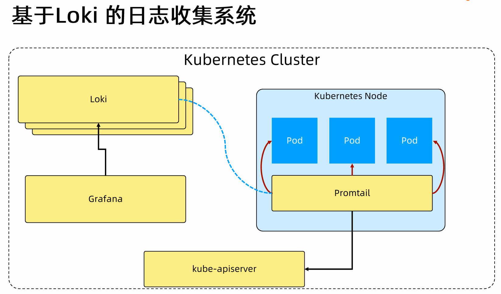

# 日志系统


把日志收集到统一位置，集中管理


## 日志收集系统 Loki

- Loki 根据标签建立索引
- 日志数据本身被压缩
- 小索引 + 高度压缩 存储要求低 降低 Loki 成本



- Promtail 监控 pod 收集日志 存入 Loki
- Grafana 查询 Loki 日志


```yaml
# pv.yaml
## Loki 需要一个持久化存储卷
apiVersion: v1
kind: PersistentVolume
metadata:
  name: pv-loki-alertmanager-0
spec:
  capacity:
    storage: 2Gi
  accessModes:
    - ReadWriteOnce
  persistentVolumeReclaimPolicy: Retain
  volumeMode: Filesystem
  storageClassName: ""  # 设置为空以匹配PVC
  hostPath:
    path: /mnt/data/loki-alertmanager-0
```
```shell
# 安装 Loki
## install helm
helm repo add bitnami "https://helm-charts.itboon.top/bitnami" --force-update
helm repo add grafana "https://helm-charts.itboon.top/grafana" --force-update
helm repo add prometheus-community "https://helm-charts.itboon.top/prometheus-community" --force-update
helm repo add ingress-nginx "https://helm-charts.itboon.top/ingress-nginx" --force-update
helm repo update

helm upgrade --install loki grafana/loki-stack \
    --set grafana.enabled=true \
    --set prometheus.enabled=true \
    --set prometheus.alertmanager.persistentVolume.enabled=false \
    --set prometheus.server.persistentVolume.enabled=false \
    --set loki.persistence.enabled=false

k get po


```


