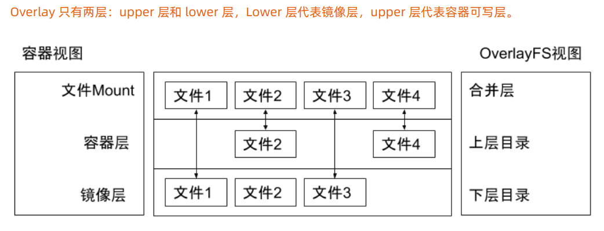

# UnionFS

`docker` 的创新点在文件系统

`docker` 的创新点在文件系统

`docker` 的创新点在文件系统

所谓的进程跑在容器里就是使用 `Namespace` 和 `Cgroup` 做隔离，
我要为进程模拟文件系统。


## Linux文件系统

- bootfs
  - bootloader 引导加载kernel
  - kernel 当kernel加载到内存中后 umount bootfs
- rootfs
  - /dev /proc /bin /etc 等标准目录和文件
  - 对于不同的linux发行版，bootfs基本一致，rootfs会有差别。


## OverlayFS



所谓的overlayFS就是mount的时候指定overlay

```shell
mkdir upper lower merged work

echo "from lower" > lower/in_lower.txt
echo "from upper" > upper/in_upper.txt
echo "from lower" > lower/in_both.txt
echo "from upper" > upper/in_both.txt

sudo mount -t overlay overlay -o lowerdir=`pwd`/lower,upperdir=`pwd`/upper,workdir=`pwd`/work `pwd`/merged
# 此时可以看到 in_both.txt 是上层的文件
cat merged/in_both.txt

rm merged/in_both.txt
rm merged/in_lower.txt
rm merged/in_upper.txt
```

可以通过 `docker inspect` 查看容器 GraphDriver，
有详细的 OverlayFS 信息。


