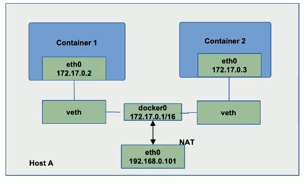

# 网络

## 同一主机下容器互联和容器与主机互联

### Null(--net=None)
- 把容器放入独立的网络空间但是不做任何网络配置
- 用户需要通过运行 `docker network` 命令来完成网络配置

#### 手动搭建网络配置

[exec-3-setup-network](exec-3-setup-network.md)


### Host
- 使用主机网络名空间 复用主机网络

使用 `HostNetwork` 虽然皆大欢喜，
但是意味着端口不能复用，
如果在主机上启动一个 `tomcat`，
再启一个就不行了，端口冲突。

一般来说容器技术，都需要不同的网络 Namespace

### Container
- 重用其他容器的网络


### Bridge(--net=bridge)(默认形式)

- 使用 `Linux` 网桥和 `iptables` 提供容器互联 
- `docker` 在每台主机上创建
一个名叫 `docker0` 的网桥，通过
`veth pair` 来链接该主机的每一个 `endpoint`

#### docker 网络配置具体细节

```log
root@docker:/home/pp# brctl show
bridge name     bridge id               STP enabled     interfaces
docker0         8000.0242264abaf5       no
```

```shell
docker run -it -p 8888:80 nginx:1.27.0
```
```log
root@docker:/home/pp/testlab/merged# docker run -it -p 8888:80 nginx:1.27.0
/docker-entrypoint.sh: /docker-entrypoint.d/ is not empty, will attempt to perform configuration
/docker-entrypoint.sh: Looking for shell scripts in /docker-entrypoint.d/
/docker-entrypoint.sh: Launching /docker-entrypoint.d/10-listen-on-ipv6-by-default.sh
10-listen-on-ipv6-by-default.sh: info: Getting the checksum of /etc/nginx/conf.d/default.conf
10-listen-on-ipv6-by-default.sh: info: Enabled listen on IPv6 in /etc/nginx/conf.d/default.conf
/docker-entrypoint.sh: Sourcing /docker-entrypoint.d/15-local-resolvers.envsh
/docker-entrypoint.sh: Launching /docker-entrypoint.d/20-envsubst-on-templates.sh
/docker-entrypoint.sh: Launching /docker-entrypoint.d/30-tune-worker-processes.sh
/docker-entrypoint.sh: Configuration complete; ready for start up
2024/10/02 10:10:00 [notice] 1#1: using the "epoll" event method
2024/10/02 10:10:00 [notice] 1#1: nginx/1.27.0
2024/10/02 10:10:00 [notice] 1#1: built by gcc 12.2.0 (Debian 12.2.0-14) 
2024/10/02 10:10:00 [notice] 1#1: OS: Linux 5.4.0-196-generic
2024/10/02 10:10:00 [notice] 1#1: getrlimit(RLIMIT_NOFILE): 1048576:1048576
2024/10/02 10:10:00 [notice] 1#1: start worker processes
2024/10/02 10:10:00 [notice] 1#1: start worker process 29
2024/10/02 10:10:00 [notice] 1#1: start worker process 30
2024/10/02 10:10:00 [notice] 1#1: start worker process 31
2024/10/02 10:10:00 [notice] 1#1: start worker process 32
```
```shell
docker ps |grep nginx
```
```log
root@docker:/home/pp# docker ps |grep nginx
fb8dddb8f8cf   nginx:1.27.0   "/docker-entrypoint.…"   43 seconds ago   Up 43 seconds   0.0.0.0:8888->80/tcp, [::]:8888->80/tcp   focused_rhodes
```
```shell
docker inspect fb8dddb8f8cf |grep -i pid
```
```log
root@docker:/home/pp# docker inspect fb8dddb8f8cf |grep -i pid
            "Pid": 1006430,
            "PidMode": "",
            "PidsLimit": null,
```
```shell
nsenter -t 1006430 -n ip a
```
```log
root@docker:/home/pp# docker inspect fb8dddb8f8cf |grep -i pid
            "Pid": 1006430,
            "PidMode": "",
            "PidsLimit": null,
root@docker:/home/pp# nsenter -t 1006430 -n ip a
1: lo: <LOOPBACK,UP,LOWER_UP> mtu 65536 qdisc noqueue state UNKNOWN group default qlen 1000
    link/loopback 00:00:00:00:00:00 brd 00:00:00:00:00:00
    inet 127.0.0.1/8 scope host lo
       valid_lft forever preferred_lft forever
    inet6 ::1/128 scope host
       valid_lft forever preferred_lft forever
11: eth0@if12: <BROADCAST,MULTICAST,UP,LOWER_UP> mtu 1500 qdisc noqueue state UP group default
    link/ether 02:42:ac:11:00:02 brd ff:ff:ff:ff:ff:ff link-netnsid 0
    inet 172.17.0.2/16 brd 172.17.255.255 scope global eth0
       valid_lft forever preferred_lft forever

```
```log
root@docker:/home/pp# nsenter -t 1006430 -n ip r
default via 172.17.0.1 dev eth0
172.17.0.0/16 dev eth0 proto kernel scope link src 172.17.0.2
```
这个容器拥有了一个独立的IP地址 `172.17.0.2` 和路由表

此时在主机上可以访问这个 IP
```log
root@docker:/home/pp# curl 172.17.0.2
<!DOCTYPE html>
<html>
<head>
<title>Welcome to nginx!</title>
<style>
html { color-scheme: light dark; }
body { width: 35em; margin: 0 auto;
font-family: Tahoma, Verdana, Arial, sans-serif; }
</style>
</head>
<body>
<h1>Welcome to nginx!</h1>
<p>If you see this page, the nginx web server is successfully installed and
working. Further configuration is required.</p>

<p>For online documentation and support please refer to
<a href="http://nginx.org/">nginx.org</a>.<br/>
Commercial support is available at
<a href="http://nginx.com/">nginx.com</a>.</p>

<p><em>Thank you for using nginx.</em></p>
</body>
</html>
```

在启动容器的时候做了一个端口映射，
此时访问主机的 `8888` 端口是可以直接访问到 nginx 服务

```log
# 这是我的虚拟机的 IP
192.168.23.110:8888
```

如何实现的呢？就是当 docker 做端口映射的时候，
会通过 `iptable` 做改写

```shell
iptables-save -t nat
```
```log
root@docker:/home/pp# iptables-save -t nat
# Generated by iptables-save v1.8.4 on Wed Oct  2 10:25:00 2024
*nat
:PREROUTING ACCEPT [0:0]
:INPUT ACCEPT [0:0]
:OUTPUT ACCEPT [21:2348]
:POSTROUTING ACCEPT [23:2452]
:DOCKER - [0:0]
-A PREROUTING -m addrtype --dst-type LOCAL -j DOCKER
-A OUTPUT ! -d 127.0.0.0/8 -m addrtype --dst-type LOCAL -j DOCKER
-A POSTROUTING -s 172.17.0.0/16 ! -o docker0 -j MASQUERADE
-A POSTROUTING -s 172.17.0.2/32 -d 172.17.0.2/32 -p tcp -m tcp --dport 80 -j MASQUERADE
-A DOCKER -i docker0 -j RETURN
-A DOCKER ! -i docker0 -p tcp -m tcp --dport 8888 -j DNAT --to-destination 172.17.0.2:80
COMMIT
# Completed on Wed Oct  2 10:25:00 2024
```
如果请求是 `TCP` 且目标端口是 `8888` ，那么
会做一个 `DNAT` 把请求转到 `172.17.0.2:80`

```log
root@docker:/home/pp# ip r
default via 10.0.2.1 dev enp0s3 proto dhcp src 10.0.2.14 metric 100
10.0.2.0/24 dev enp0s3 proto kernel scope link src 10.0.2.14
10.0.2.1 dev enp0s3 proto dhcp scope link src 10.0.2.14 metric 100
172.17.0.0/16 dev docker0 proto kernel scope link src 172.17.0.1
192.168.34.0/24 dev enp0s8 proto kernel scope link src 192.168.34.110
```





## 容器之间的跨主机互联

kubernetes 中的 CNI 部分详细介绍

### Overlay
- 隧道模式 通过网络封包解包实现

容器之间的网络不互通 但是主机之间的网络是互通的


### Underlay
- 使用现有底层网络 为每一个容器配置可路由的网络IP


