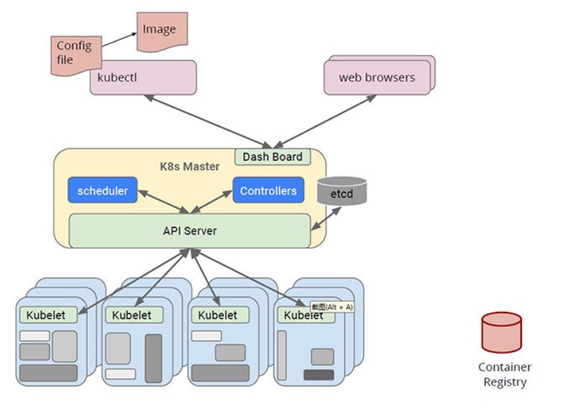
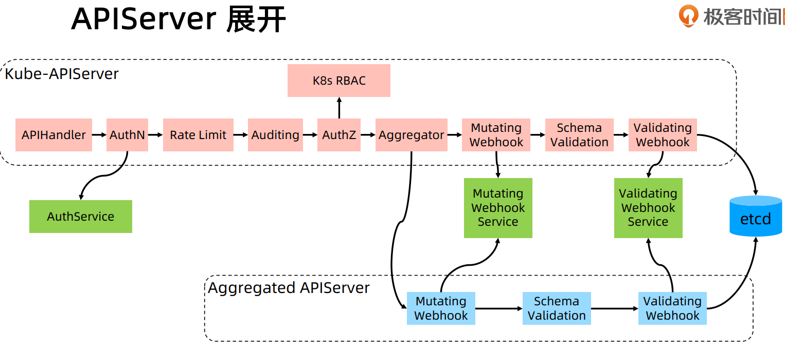
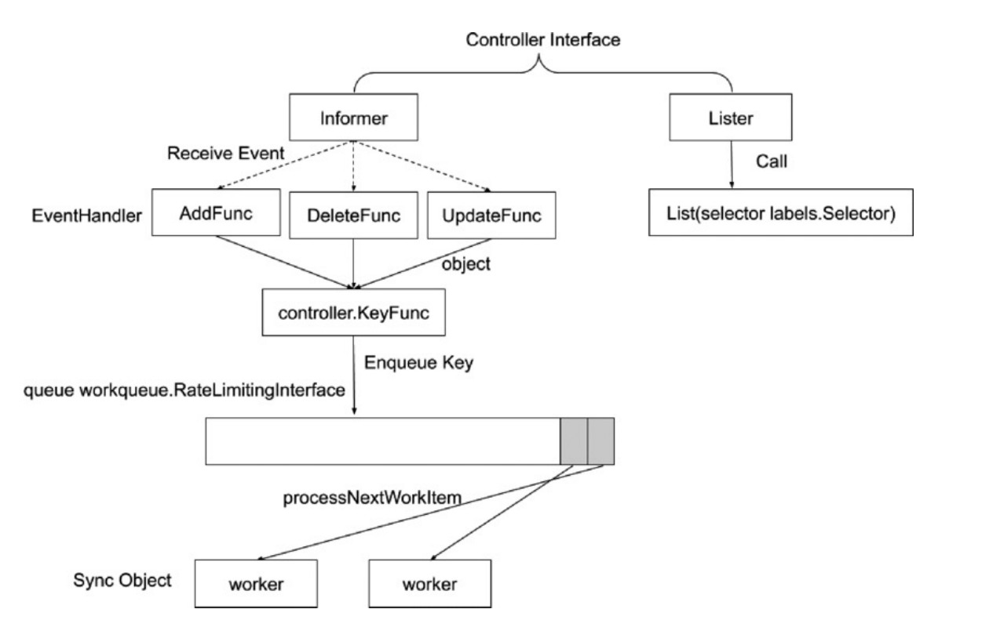
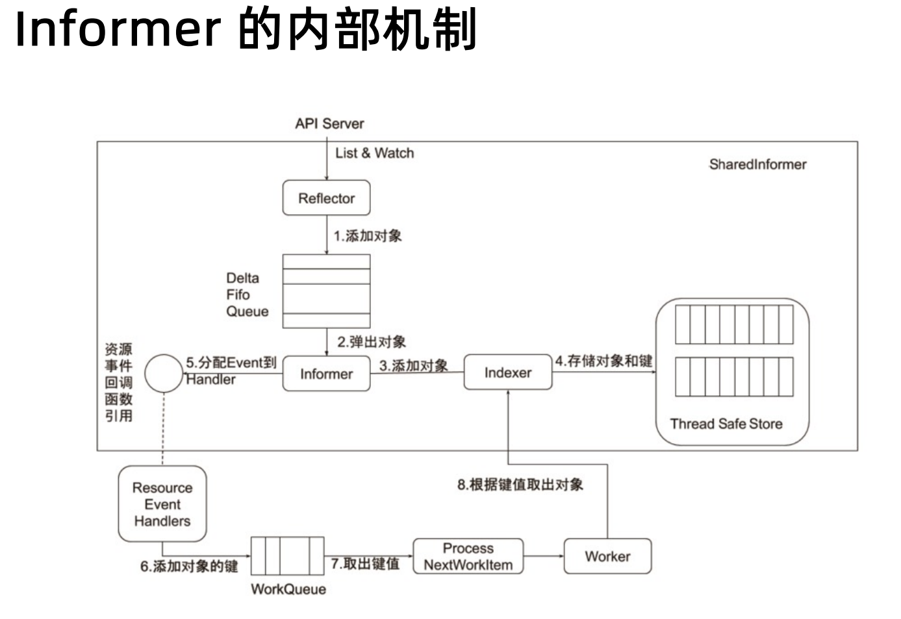
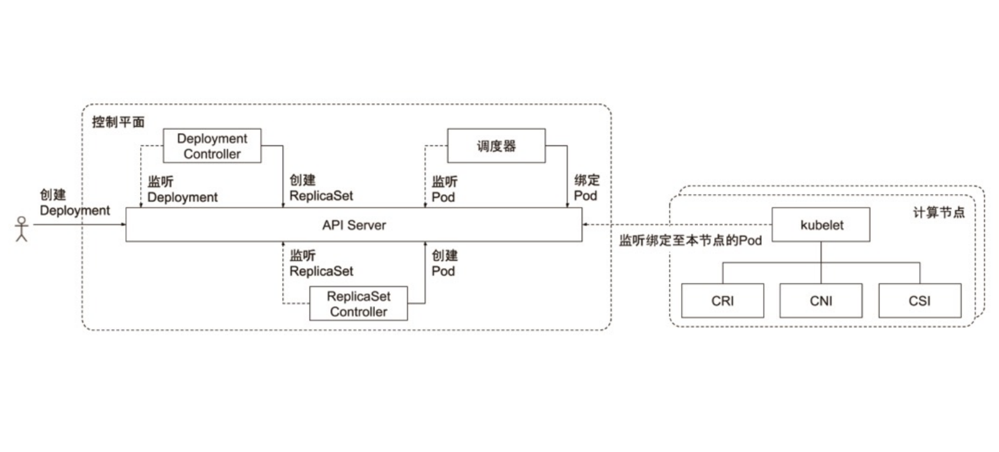

# Kubernetes


## 代码结构

- /api/openapi-spec/swagger.json api 定义
- /build 编译脚本
- /cmd 所有二进制的编译的入口都在这里 k8s组件 main函数
- /pkg k8s的功能模块的复杂实现


## Kubernetes 声明式系统

核心对象：

- Node：计算节点的抽象 描述计算节点的资源抽象 健康状态等
- Namespace：资源隔离的基本单位 可以简单理解为文件系统的目录结构
- Pod：描述应用示例 包括镜像地址 资源需求等（k8s中最核心的对象）
- Service：如何将应用发布成服务 本质上是负载均衡和域名服务的声明




所有的组件都与 `API Server` 通信 是整个集群请求的路由器，
认证、鉴权、校验、授权、准入等


- Kubelet 节点上报给 `API Server` 节点资源情况 启容器实例 用 `ns` 做隔离 `cgroup` 做资源限制
- etcd 基于 `raft` 协议的键值对存储
- scheduler 做调度（Kubelet会把节点信息上报）找到一个节点更新到 `etcd`
- controllers 一直去监控当前集群的状态和他的对象 如果对象发生了变化 控制器就会做一些操作


## etcd

etcd 是基于 raft 协议的开发的 `key-value` 存储，用于服务发现，共享配置，一致性保障
（如数据库选主，分布式锁等）

- 基本的 `key-value` 存储
- 监听机制
- `key` 的过期及续约机制 用于监控和服务发现
- 原子 `CAS` `CAD` 用于分布式锁和 `leader` 选举

#### 直接访问 etcd 数据

```shell
# 启动一个 nginx pod
k create deployment nginx --image=nginx:1.27.0
```

```shell
# 进入 etcd pod
ks exec -it etcd-master -- /bin/sh
```
```shell
# 进入到容器 sh $ sh-5.2
export ETCDCTL_API=3

# 查看 prefix /
etcdctl --endpoints https://localhost:2379 \
  --cert /etc/kubernetes/pki/etcd/server.crt \
  --key /etc/kubernetes/pki/etcd/server.key \
  --cacert /etc/kubernetes/pki/etcd/ca.crt \
  get --keys-only --prefix /

# watch nginx
etcdctl --endpoints https://localhost:2379 \
  --cert /etc/kubernetes/pki/etcd/server.crt \
  --key /etc/kubernetes/pki/etcd/server.key \
  --cacert /etc/kubernetes/pki/etcd/ca.crt \
  watch --prefix /registry/pods/default/nginx-bdf578756-gkx5s

```
```shell
# edit nginx pod
k edit po nginx-bdf578756-gkx5s
```
```log
# 会发现 watch 的长连接有了响应

PUT
/registry/pods/default/nginx-bdf578756-gkx5s
k8s

v1Pod�
..............
```

## API Server

是唯一一个与 `etcd` 通讯的组件

- 提供集群管理的 `REST API` 接口
  - 认证
  - 授权
  - 准入
- 提供其他模块之间的数据交互和通讯枢纽（只有 `API Server` 直接操作 `etcd`）
- `API Server` 提供 `etcd` 数据缓存以减少集群对 `etcd` 的访问



- `APIHandler`：不同的 `API` 功能
- `AuthN`：认证
- `Rate Limit`：限流（根据不同的访问请求做不同的限流策略）
- `Auditing`：安全审计 记录访问日志
- `AuthZ`：鉴权（k8s `RBAC`）
- `Aggregator`：扩展 可以开发自己的逻辑 内嵌到 `API Server`


## Controller Manager

每一个 `Controller Manager` 都是一个生产者消费者模型，
一边监控 `API Server` 的变化 使用 `API Server` 的 `watch` 请求，
生产者可以观测这些变化放入到一个队列中，
消费着从队列中取数据，然后做配置，
`Controller` 如果配置失败通常会触发自动尝试，
整个集群会在控制器不断重试的机制下确保最终一致性

### 控制器的工作流程




### informer 的内部机制



- `List & Watch` : `api server` 提供 `RESTful api` 和 `watch` 机制
- `Reflector`：反序列化数据 把字串转化为 `GO` 对象 放在内存中
- `Delta Fifo Queue`：环状内存结构 如果 `buffer` 满了 直接覆盖最老的数据


最佳实践：

任何控制器都应该使用 `SharedInformer` 框架，
所有的对象已经在本地有了缓存，
由 `SharedInformer` 保证了本地的缓存和 `api server` 版本一致性，
所以当我们写控制器的时候应该避免访问 `api server`

- 1、`SharedInformer` 会通知你
- 2、对象的信息会保存在本地缓存 读取任何完整对象都应该在 `Thread Safe Store` 中读取
- 3、只有更新的时候会访问 `api server`

如果每个组件都遵守这个模式 那么 `api server` 的压力不大，
如果频繁的访问 `api server` 会把 `api server` 压死


### 控制器的协同工作原理




#### demo

```yaml
# ks-nginx-deployment.yaml
apiVersion: apps/v1
kind: Deployment
metadata:
  name: nginx
spec:
  replicas: 1
  selector:
    matchLabels:
      app: nginx
  template:
    metadata:
      labels:
        app: nginx
    spec:
      containers:
        - image: nginx:1.27.0
          name: nginx
```

```shell
k create -f ks-nginx-deployment.yaml

k get deployment
# NAME    READY   UP-TO-DATE   AVAILABLE   AGE
# nginx   1/1     1            1           21s

k describe deployment nginx
# ....
# Events:
#   Type    Reason             Age    From                   Message
#   ----    ------             ----   ----                   -------
#   Normal  ScalingReplicaSet  4m30s  deployment-controller  Scaled up replica set nginx-bdf578756 to 1
```

```shell
# 根据 Events 信息 查看 Replica Set 信息
k describe rs nginx-bdf578756

# ....
# Events:
#   Type    Reason            Age    From                   Message
#   ----    ------            ----   ----                   -------
#   Normal  SuccessfulCreate  8m10s  replicaset-controller  Created pod: nginx-bdf578756-spk7l
```

```shell
k get po nginx-bdf578756-spk7l -owide
# NAME                    READY   STATUS    RESTARTS   AGE   IP               NODE    NOMINATED NODE   READINESS GATES
# nginx-bdf578756-spk7l   1/1     Running   0          12m   10.244.166.141   node1   <none>           <none>

curl 10.244.166.141
# ....
# <h1>Welcome to nginx!</h1
```


- **创建 Deployment**：用户通过 `kubectl` 提交 `Deployment`，描述期望状态。
- **API Server 处理**：
  - 认证、鉴权、准入控制。
  - 存储到 etcd。
- **Deployment Controller**：根据 `Deployment` 创建/更新 `ReplicaSet`。
- **ReplicaSet Controller**：维护 Pod 副本数，确保 Pod 数量正确。
- **调度器**：为未分配节点的 Pod 选择节点并分配 nodeName
- **Kubelet 启动 Pod**：拉取镜像并启动 Pod。
- **Pod 运行**：通过探针监控 Pod 状态。


**为什么使用 `Deployment` 而不是一个单独的 `Pod` ?**

如果单独启动一个 `Pod`，
删除这个 `Pod` 就会消失，
但是如果是 `Deployment` 删除之后，
由于各种控制器的相互配合，
就会重新启动一个 `Pod`，
这就是故障转移，
在 `Kubernetes` 中故障转移天然就有


```shell
k get po
# NAME                    READY   STATUS    RESTARTS   AGE
# nginx-bdf578756-spk7l   1/1     Running   0          37m

k delete po nginx-bdf578756-spk7l
# pod "nginx-bdf578756-spk7l" deleted

k get po
# NAME                    READY   STATUS    RESTARTS   AGE
# nginx-bdf578756-vw4xh   1/1     Running   0          3s

k edit deployment nginx
# 把 replicaset 改成 3
# deployment.apps/nginx edited

k get po
# NAME                    READY   STATUS    RESTARTS   AGE
# nginx-bdf578756-9f7fq   1/1     Running   0          5s
# nginx-bdf578756-q772d   1/1     Running   0          5s
# nginx-bdf578756-vw4xh   1/1     Running   0          51s

k delete po nginx-bdf578756-9f7fq
# pod "nginx-bdf578756-9f7fq" deleted

k get po
# NAME                    READY   STATUS    RESTARTS   AGE
# nginx-bdf578756-mmb4x   1/1     Running   0          4s
# nginx-bdf578756-q772d   1/1     Running   0          29s
# nginx-bdf578756-vw4xh   1/1     Running   0          75s

k describe rs nginx-bdf578756
# ....
# Events:
#   Type    Reason            Age   From                   Message
#   ----    ------            ----  ----                   -------
#   Normal  SuccessfulCreate  39m   replicaset-controller  Created pod: nginx-bdf578756-spk7l
#   Normal  SuccessfulCreate  100s  replicaset-controller  Created pod: nginx-bdf578756-vw4xh
#   Normal  SuccessfulCreate  54s   replicaset-controller  Created pod: nginx-bdf578756-9f7fq
#   Normal  SuccessfulCreate  54s   replicaset-controller  Created pod: nginx-bdf578756-q772d
#   Normal  SuccessfulCreate  29s   replicaset-controller  Created pod: nginx-bdf578756-mmb4x

k describe deployment nginx
# ....
# Events:
#   Type    Reason             Age    From                   Message
#   ----    ------             ----   ----                   -------
#   Normal  ScalingReplicaSet  43m    deployment-controller  Scaled up replica set nginx-bdf578756 to 1
#   Normal  ScalingReplicaSet  5m33s  deployment-controller  Scaled up replica set nginx-bdf578756 to 3 from 1

```

这样就完成了冗余部署，
但是还有负载均衡，
`Kubernetes` 提供了一个对象叫做 `Service`

```shell
k expose deploy nginx --selector app=nginx --port=80 --type=NodePort
# service/nginx exposed

k get svc
# NAME         TYPE        CLUSTER-IP       EXTERNAL-IP   PORT(S)        AGE
# kubernetes   ClusterIP   10.96.0.1        <none>        443/TCP        13d
# nginx        NodePort    10.111.153.197   <none>        80:31532/TCP   10s

curl 10.111.153.197
# <h1>Welcome to nginx!</h1>

```

这个时候删除任何 `Pod` 这个 `nginx` 服务依旧可用 应用已经高可用


`Deployment` 有一个 `strategy` `rollingupdate` 滚动升级

- `maxSurge` 允许先出来新版本最大比例
- `maxUnavailable` 如果有这么多的 `pod` 出现问题 就不要升级了

这样确保服务一直有效

如何做滚动升级

```shell
# 修改 image tag
k edit deploy nginx
# deployment.apps/nginx edited

k get po
# NAME                     READY   STATUS              RESTARTS   AGE
# nginx-548dcd6489-5rmmk   0/1     ContainerCreating   0          0s
# nginx-548dcd6489-79q5v   1/1     Running             0          2s
# nginx-548dcd6489-wkrst   1/1     Running             0          1s
# nginx-bdf578756-c6gj7    0/1     Terminating         0          62s
# nginx-bdf578756-rbztr    1/1     Running             0          60s

k get po
# NAME                     READY   STATUS    RESTARTS   AGE
# nginx-548dcd6489-5rmmk   1/1     Running   0          4s
# nginx-548dcd6489-79q5v   1/1     Running   0          6s
# nginx-548dcd6489-wkrst   1/1     Running   0          5s

k describe deploy nginx
# ....
# Events:
#   Type    Reason             Age                  From                   Message
#   ----    ------             ----                 ----                   -------
#   Normal  ScalingReplicaSet  40m                  deployment-controller  Scaled up replica set nginx-bdf578756 to 3 from 1
#   Normal  ScalingReplicaSet  5m31s                deployment-controller  Scaled up replica set nginx-548dcd6489 to 1
#   Normal  ScalingReplicaSet  2m57s                deployment-controller  Scaled down replica set nginx-bdf578756 to 1 from 2
#   Normal  ScalingReplicaSet  2m57s                deployment-controller  Scaled up replica set nginx-548dcd6489 to 3 from 2
#   Normal  ScalingReplicaSet  2m39s                deployment-controller  Scaled up replica set nginx-bdf578756 to 1 from 0
#   Normal  ScalingReplicaSet  2m37s                deployment-controller  Scaled down replica set nginx-548dcd6489 to 2 from 3
#   Normal  ScalingReplicaSet  2m37s                deployment-controller  Scaled up replica set nginx-bdf578756 to 2 from 1
#   Normal  ScalingReplicaSet  98s (x2 over 2m58s)  deployment-controller  Scaled down replica set nginx-bdf578756 to 2 from 3
#   Normal  ScalingReplicaSet  98s (x2 over 2m58s)  deployment-controller  Scaled up replica set nginx-548dcd6489 to 2 from 1
#   Normal  ScalingReplicaSet  97s (x6 over 2m27s)  deployment-controller  (combined from similar events): Scaled up replica set nginx-548dcd6489 to 3 from 2
#   Normal  ScalingReplicaSet  96s (x2 over 2m56s)  deployment-controller  Scaled down replica set nginx-bdf578756 to 0 from 1
```

根据 `template` 计算字符串的哈希值，
哈希值发生变化，
`Deployment Controller` 接收这个变化，
控制器的工作原理


### Kubelet

是整个 Kubernetes 的初始化系统


