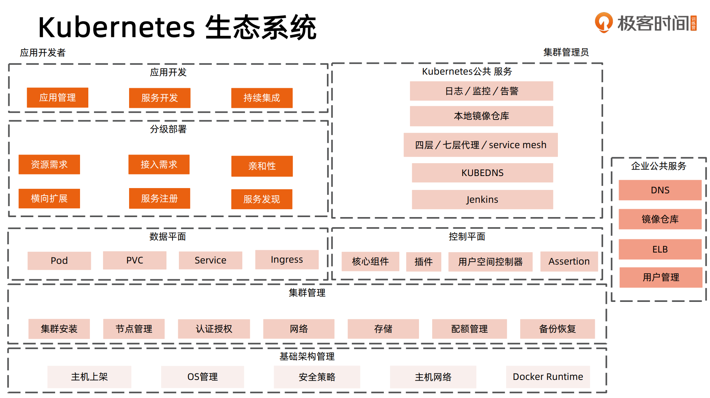
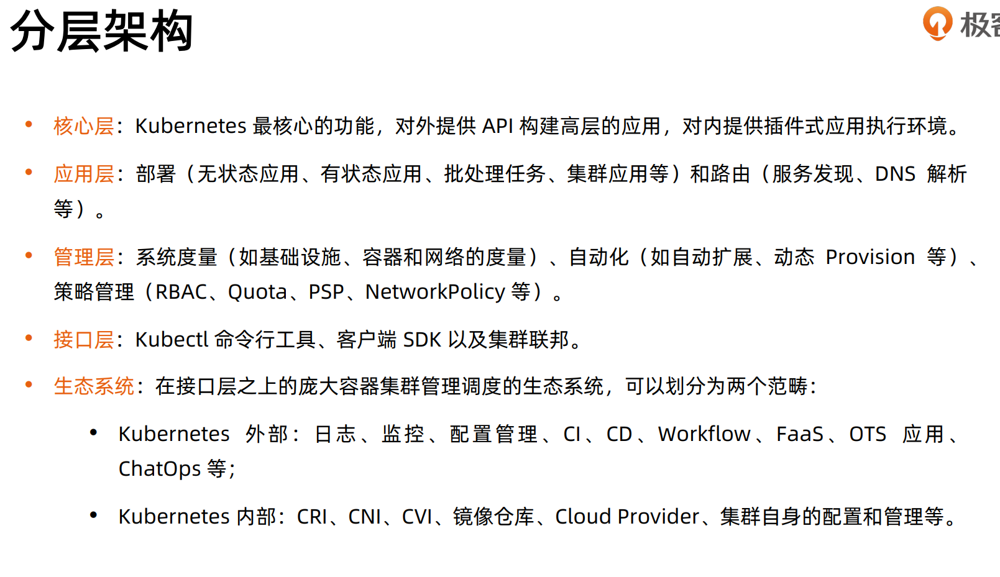
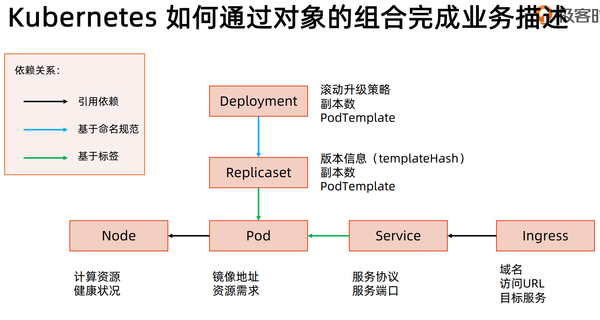

# 深入理解 k8s 和云计算








### API 设计原则
- 所有的 `API` 都应该是声明式的
- `API` 对象彼此互补且可组合
  - 高内聚 松耦合 例如 `Deployment` 和 `ReplicaSet` 分离
- 高层 `API` 以操作意图为基础设计 
  - 高层 `API` 一定是以业务出发 而不是过早的从技术实现出发
  - 在云原生基础之上扩展功能 首先要抽象 `API` 思考需要满足什么需求
- 低层 `API` 根据高层 `API` 的控制需要设计
  - 减少冗余 提高重用性 以需求为基础 而不是受技术实现影响
- 尽量避免简单封装
  - 例如 `StatefulSet` 和 `ReplicaSet` 本来就是两种 `Pod` 集合那么 `k8s` 就用不同的 `API` 来定义他们 而不是使用同一个 `ReplicaSet` 然后区分是否有状态





- 基于引用依赖：对象有个属性的名字指向了其他对象
  - `Pod.nodeName` -> `Node`
- 基于命名规范：命名具有连贯性
  - `Deployment`：用户自定义的，例如 `my-app-deployment`
  - `ReplicaSet`：`my-app-deployment-abc12345`（哈希）
  - 如果哈希算法变了 那么 `Deployment` 找不到新的哈希名称 集群所有实例翻一番
- 基于标签：基于标签的过滤条件
  - `ReplicaSet` -> `Pod` 根据 `metadata.labels` 过滤查询
  - `Service` -> `Pod`


### 架构设计原则

- 只有 `APIServer` 访问 `etcd` 其他服务必须通过 `kubernetes API` 访问集群状态
- 局部故障不应该影响集群状态
- 没有新的请求的情况下，所有组件应该在故障恢复后继续执行上次最后收到的请求
  - 在做设计的时候应该假定任何环节都会出问题
  - 第一 出故障的时候会不会出现数据不一致的情况
  - 第二 故障恢复以后控制器行为是什么样的
  - eg：控制器恢复以后不应该把所有的 `Pod` 都重启
- 所有的组件都应该在内存中保持所需要的状态 不要频繁查 `APIServer`
- 优先使用事件监听而不是轮询


### 引导（Bootstrapping）原则


- self-hosting
- kubelet 由 systemd 管理

```shell
# 查看 kubelet 配置
ps -ef |grep kubelet
cat /var/lib/kubelet/config.yaml
# staticPodPath: /etc/kubernetes/manifests
# kubelet 一直扫描这个目录的文件 创建 Pod
# 这种是 staticPod
```


