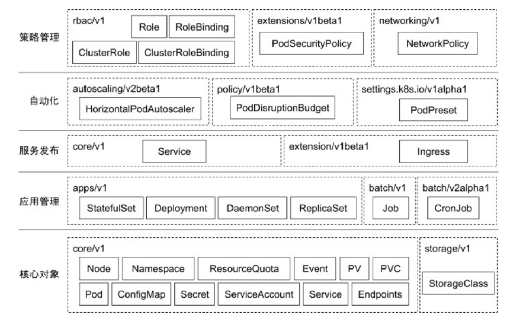
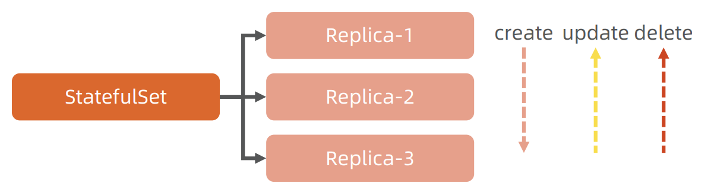

# 核心技术概念和 API 对象


每一个 `API` 对象都有四大类属性：
- `TypeMeta`
  - 定义这个对象是什么
- `MetaData`
  - 定义这个对象的 名字 标签
- `Spec`
  - 用户的期望值
- `Status`
  - 对象实际状态

### TypeMeta

- 1、`Group`
- 2、`Kind`
  - `Node` `Pod` `Deployment` `StatefulSet` ...
- 3、`Version`


### MetaData

两个最重要的属性：`Namespace` 和 `Name`，这两个属性唯一定义了某个对象实例。


#### 1、Label

做过滤查询 StringMap 打标签 `k8s` 提供了针对 `label` 的过滤功能

```shell
k get po
# NAME                     READY   STATUS    RESTARTS        AGE
# nginx-548dcd6489-5rmmk   1/1     Running   1 (4m16s ago)   45h
# nginx-548dcd6489-79q5v   1/1     Running   1 (4m14s ago)   45h
# nginx-548dcd6489-wkrst   1/1     Running   1 (4m16s ago)   45h

k label po nginx-548dcd6489-5rmmk a=b
# pod/nginx-548dcd6489-5rmmk labeled

k get po -l a=b
# NAME                     READY   STATUS    RESTARTS        AGE
# nginx-548dcd6489-5rmmk   1/1     Running   1 (4m41s ago)   45h
```

#### 2、Annotation

属性扩展 附加属性 StringMap

项目名/属性名：属性值

```shell
k get no -oyaml

# annotations:
#     kubeadm.alpha.kubernetes.io/cri-socket: unix:///var/run/containerd/containerd.sock
#     node.alpha.kubernetes.io/ttl: "0"
#     projectcalico.org/IPv4Address: 192.168.34.101/24
#     projectcalico.org/IPv4IPIPTunnelAddr: 10.244.219.64
#     volumes.kubernetes.io/controller-managed-attach-detach: "true"
```

#### 3、Finalizer

资源锁 做删除请求时 并不会直接删除对象 而是更新 `deletionTimestamp` 字段

等待外部资源清理之后，再进行资源删除 删除时只需要把 `finalizer` 字段删除即可


```shell
k run --image=nginx:1.27.0 nginx --restart='Always'
# pod/nginx created

k get po
# NAME                     READY   STATUS    RESTARTS      AGE
# nginx                    1/1     Running   0             4s

k edit po nginx
# pod/nginx edited

k delete po nginx
# pod "nginx" deleted

k get po
# NAME                     READY   STATUS        RESTARTS      AGE
# nginx                    0/1     Terminating   0             2m20s

k get po nginx -oyaml
# metadata:
#   deletionTimestamp: "2024-10-06T03:51:15Z"
#   finalizers:
#   - kubernetes
  
k edit po nginx
# pod/nginx edited

k get po
NAME                     READY   STATUS    RESTARTS      AGE
```


在配置外部资源时，
首先需要在对象上加上 `finalizer`，
这样可以确保对象在删除前不会直接消失，
从而有机会执行资源清理操作。
接着，进行外部资源的配置。当对象需要删除时，
控制器会在对象删除流程中优先清理外部资源，
确保外部配置不被泄露。在外部资源清理完成后，
控制器会移除对象上的 `finalizer`。`finalizer` 移除后，
`Kubernetes` 才会真正删除对象，确保整个过程中外部资源被安全清理，
不留下任何遗留问题。


#### 4、ResourceVersion


乐观锁 版本控制 分布式系统

在分布式系统中， 不能使用锁，会发生饿死、死锁

确保分布式系统中任意多线程能够无锁并发访问对象，提升系统整体效率

```shell
k get po nginx-548dcd6489-5rmmk -oyaml
# apiVersion: v1
# kind: Pod
# metadata:
#   resourceVersion: "189967"
```


### Spec 和 Status

`Spec` 和 `Status` 是对象的核心，是每个对象独有的

`TypeMeta` 和 `MetaData` 是通用属性


### Kubernetes 常用对象



### Pod

应用和配置分离

- 应用 -> 容器镜像
- 配置 -> 环境变量

环境变量
- 直接设置值
- 读取 `Pod` `Spec` 属性
  - `containers` 中有 `env` 的字段
- 从 `ConfigMap` 读取某个值

#### 环境变量

##### 1、直接设置值

##### 2、读取 Pod Spec 属性
```yaml
env:
- name:HELLO
  value:world  
```

```yaml
env:
  - name: MY_POD_NAME
    valueFrom:
      fieldRef:
        fieldPath: metadata.name
```

##### 3、ConfigMap

```yaml
apiVersion: v1
kind: ConfigMap
metadata:
  name: example-config
  namespace: default
data:
  # 配置项1：定义一个简单的键值对
  key1: value1
  # 配置项2：可以存储多行数据
  config-file: |
    line1: value1
    line2: value2
    line3: value3
```

```yaml
env:
  - name: CONFIG_KEY1
  valueFrom:
    configMapKeyRef:
      name: example-config
      key: key1
```

```shell
env
# CONFIG_KEY1=value1
```

#### 存储卷


#### Pod 网络
Pod 多个容器共享网络的 Namespace 


#### 资源限制


#### 健康检查

##### 探针类型
- `LivenessProbe`
  - 查看应用是否活着 不活就要杀死
- `ReadinessProbe`
  - `Pod` 有没有就绪 如果 `ReadinessProbe` 还没过 就不应该接受流量和请求
  - 应用进程不会重启 `k8s` 不会动这个 `Pod` 只会标上 `notReady`
  - `Service` 中不会把这个 `Pod` 加进来
- `startupProbe`
  - 某些应用在初始化的阶段是不能频繁的做探针
  - 启动需要很长时间 如果频繁的做探活
  - 会有很多的探活 `pending`
  - 给应用带来很大的压力
  - 在初始化阶段以更低的频度做探活

```yaml
# 以什么方式做检查
exec:
  command:
  - cat
  - /tmp/healthy
# 出了多少次错误才认为是 failure
failureThreshold:3
# 等多长时间开始做
initialDelaySeconds:5
# 间隔多少时间做
periodSeconds:5

succeddThreshold:1
# 多久超时
timeoutSeconds:1

```

##### 探活方式
- `Exec`
  - 在容器里执行一个脚本
- `TCP socket`
  - 做一个端口检查 由 `kubelet` 做
- `HTTP`
  - 做一个 `http call`


### 用户（User Account）和服务账户（Service Account）


### StatefulSet





### job

一次性任务


