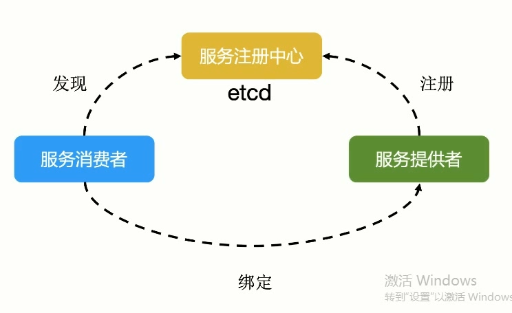
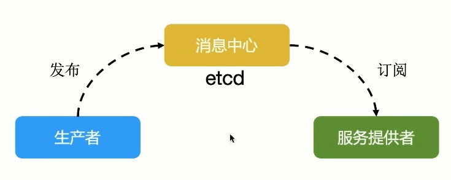

# ETCD

主要功能：

- `key-value` 存储
- 监听机制
- `key` 的过期及续约机制 用于监控和服务发现
- 原子操作 用于分布式锁和 `leader` 选举

### 键值存储


### 服务注册与发现

- 强一致性、高可用的服务存储目录
  - 基于 `raft` 协议的 `etcd` 天生就是强一致性、高可用的服务存储
- 一种注册服务和服务健康状况的机制
  - 用户可以在 `etcd` 中注册服务，对注册的服务配置 `key ttl`，定时保持服务的心跳以达到监控健康状态的效果




`etcd` 天然满足这种需求，服务提供者向 `etcd` 周期时间续约，
提供服务 `IP` 和健康状况


### 消息发布与订阅

生产者产生消息 消费者订阅消息





## 使用 ETCD

```shell
# kubernetes etcd 默认使用 2379 端口
etcd --listen-client-urls 'http://localhost:12379' \
 --advertise-client-urls 'http://localhost:12379' \
 --listen-peer-urls 'http://localhost:12380' \
 --initial-advertise-peer-urls 'http://localhost:12380' \
 --initial-cluster 'default=http://localhost:12380'


```
```shell
etcdctl --endpoints=http://localhost:12379 put a b

etcdctl --endpoints=http://localhost:12379 get a

etcdctl --endpoints=http://localhost:12379 watch a

etcdctl --endpoints=http://localhost:12379 put a bb
```


```shell
etcdctl --endpoints=http://localhost:12379 member list --write-out=table

# +------------------+---------+---------+------------------------+------------------------+------------+
# |        ID        | STATUS  |  NAME   |       PEER ADDRS       |      CLIENT ADDRS      | IS LEARNER |
# +------------------+---------+---------+------------------------+------------------------+------------+
# | c9ac9fc89eae9cf7 | started | default | http://localhost:12380 | http://localhost:12379 |      false |
# +------------------+---------+---------+------------------------+------------------------+------------+

```

```shell
# 所有的 key 按照目录去组织
# 在使用 k8s 的时候就是通过访问一个路径

curl https://xxx/api/v1/namespaces/default

etcdctl --endpoints=http://localhost:12379 get --prefix /
```

```shell
# 在 k8s 中如果我想列出所有的 namespaces
etcdctl get --prefix /api/v1/namespaces
# 通过前缀把不同的对象分到不同的目录结构里去
```


```shell
# 使用 keys-only 列出 k8s 对象 因为 value 都是很大的数据
etcdctl get --prefix / --keys-only
```

```shell
# debug 信息
etcdctl get a --debug
```


```shell
# watch prefix
etcdctl watch --prefix /
# watch 以 / 开头的对象

# watch 所有的 namespaces
etcdctl watch --prefix /api/v1/namespaces
# watch default namespaces
etcdctl watch --prefix /api/v1/namespaces/default
```

## 查看 Kubernetes etcd 数据

```shell
ps -ef |grep etcd
#root        1334    1104  8 03:01 ?        00:00:03 
#    etcd --advertise-client-urls=https://192.168.34.101:2379 
#         --cert-file=/etc/kubernetes/pki/etcd/server.crt 
#         --client-cert-auth=true 
#         --data-dir=/var/lib/etcd 
#         --experimental-initial-corrupt-check=true 
#         --experimental-watch-progress-notify-interval=5s 
#         --initial-advertise-peer-urls=https://192.168.34.101:2380 
#         --initial-cluster=master=https://192.168.34.101:2380 
#         --key-file=/etc/kubernetes/pki/etcd/server.key 
#         --listen-client-urls=https://127.0.0.1:2379,https://192.168.34.101:2379 
#         --listen-metrics-urls=http://127.0.0.1:2381 
#         --listen-peer-urls=https://192.168.34.101:2380 
#         --name=master 
#         --peer-cert-file=/etc/kubernetes/pki/etcd/peer.crt 
#         --peer-client-cert-auth=true 
#         --peer-key-file=/etc/kubernetes/pki/etcd/peer.key 
#         --peer-trusted-ca-file=/etc/kubernetes/pki/etcd/ca.crt 
#         --snapshot-count=10000 
#         --trusted-ca-file=/etc/kubernetes/pki/etcd/ca.crt

ks exec -it etcd-master -- /bin/sh

etcdctl \
    --endpoints https://127.0.0.1:2379 \
    --cert /etc/kubernetes/pki/etcd/server.crt \
    --key /etc/kubernetes/pki/etcd/server.key \
    --cacert /etc/kubernetes/pki/etcd/ca.crt member list
# f97f0299944919f6, started, master, https://192.168.34.101:2380, https://192.168.34.101:2379, false


etcdctl \
    --endpoints https://127.0.0.1:2379 \
    --cert /etc/kubernetes/pki/etcd/server.crt \
    --key /etc/kubernetes/pki/etcd/server.key \
    --cacert /etc/kubernetes/pki/etcd/ca.crt \
    get --prefix / --keys-only

# /registry/pods/kube-system/coredns-cb4864fb5-jw595
# /registry/pods/kube-system/coredns-cb4864fb5-qqvqk
# /registry/pods/kube-system/etcd-master
# /registry/pods/kube-system/kube-apiserver-master
# /registry/pods/kube-system/kube-controller-manager-master
# /registry/pods/kube-system/kube-proxy-2bqws
# /registry/pods/kube-system/kube-proxy-jrrlc
# /registry/pods/kube-system/kube-proxy-plpdv

```

