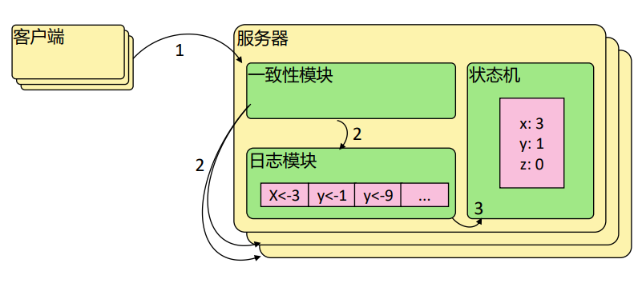
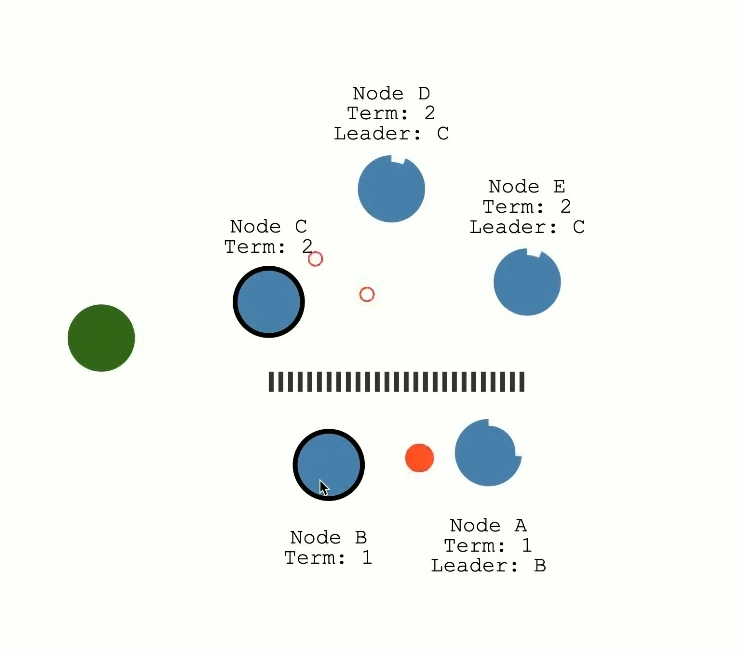

# raft 协议

https://thesecretlivesofdata.com/

为什么要分布式系统？
**数据安全**

如果可以保证数据在多个节点上，
同时保证一致性和时效性，
如果任意一个节点出现故障，
可以保证数据是安全的，
只要还有节点，
数据就能正常恢复

每个节点都有 3 种状态
- `follower`
  - 系统初始为 `follower`
  - 选举过期时间
  - 超过选举过期时间 成为 `candidate` 发起投票
  - 收到其他 `leader` 心跳 重置选举过期时间
  - 天然同期投票
- `candidate`
    - 拿到超过半数投票 称为 `leader`
    - 收到投票请求
      - `term` 如果请求的 `term` 大于当前 `term` 则成为 `follower` 并投票
      - `index` 即使 `term` 满足条件 如果请求的 `index` 更旧 依旧不投票
- `leader`
  - 所有的操作从 `leader` 发起
    - 在本地写日志 并把信息随着心跳发送到各节点
    - 此时并没有真正的操作数据 落盘 如果此时 `leader` `down` 则数据丢失
    - 收到回应 如果超过半数节点写日志 则自己 `commit` 这个数据
    - 此时通知客户端数据以写好 同时发起心跳 让各节点也 `commit`
    - 数据操作成功 `log replication`

## 选主

启动的时候所有的人天然都是 `follower` 状态，
会出现大家一起拉投票情况嘛？
如何减少？

设置 `election timeout` 选举超时时间，
一个 `follower` 成为 `candidate` 时间 `150-300ms random`，
先到达的成为 `candidate` 并发起投票，
其他人收到投票并且确认，
同时选举超时时间重置，
然后 `candidate` 变成 `leader`，
此时需要保持 `leader` 地位，
一直发心跳，
告诉其他人，
我是领导，为了让其他人的，选举超时时间重置，
不让其他人成为 `candidate`，
所有的数据都是跟着心跳信息走的。

### 把 leader 停掉

此时 `leader` 没有心跳发出去，
剩下的节点选举超时时间不一样，
先到达的成为 `candidate` 并发起投票，
超过半数同意成为 `leader`，
任期 `term` 增加，
新任期的 `leader` 更有话语权

### 如果多个 candidate 同时发起投票

如果 `candidate` 获得没有超过半数的投票，
则本次投票失败，
再次等待一个选举超时时间

## 出现网络分区

- 1、网络分区导致集群分裂
  - `Node B` 是之前的 `Leader`，但是由于网络分区，它和 `Node C`、`Node D`、`Node E` 这三个节点无法通信
  - `Node A` 仍然与 `Node B` 保持连接，但两者无法与集群的其他部分通信
  - `Node C`、`Node D`、`Node E` 由于和大多数节点（超过半数）在一起，它们成功选举出一个新的 `Leader`（`Node C`），并且该 `Leader` 的 任期（`term`） 增加了
- 2、数据不一致
  - `Node B` 和 `Node A` 因为没有和大多数节点通信，无法成功提交任何新数据的写入请求。即便客户端向它们发起写入请求，`Leader B` 也无法拿到多数派的确认，所以写入操作会失败，进入只读模式
  - 与此同时，`Node C`、`Node D`、`Node E` 这三个节点因为在同一分区，并且选举出了新的 `Leader` `Node C`，所以可以正常进行数据写入和提交操作
- 3、网络分区恢复后的一致性恢复
  - 当网络分区恢复后，之前分裂的两个区域重新能够通信
  - `Node A` 和 `Node B` 会意识到 `Node C` 是新任期的 `Leader`，并会接受 `Node C` 的领导
  - `Node C` 会将它任期内的已提交日志条目复制给 `Node A` 和 `Node B`，使整个系统的数据重新保持一致
- 关键点
  - 分区期间的读写操作：由于 `Node B` 和 `Node A` 处于少数派，它们在分区期间无法提交任何写操作，因此会进入只读状态。而多数派 `Node C`、`Node D`、`Node E` 则可以正常进行数据写入
  - 网络恢复后的一致性保证：`Raft` 协议通过日志复制机制，在网络分区恢复后，能够将所有节点的日志重新同步，从而恢复系统的一致性

## learner

只接受数据 不参与投票

`quorum` 不变 即集群的一致性数量不变

