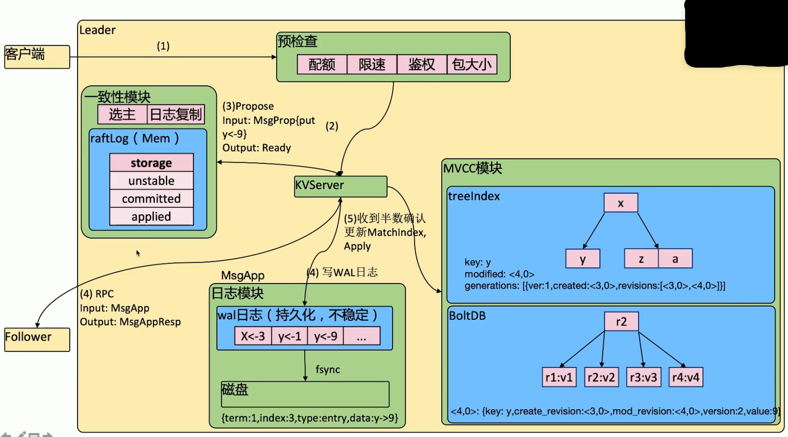
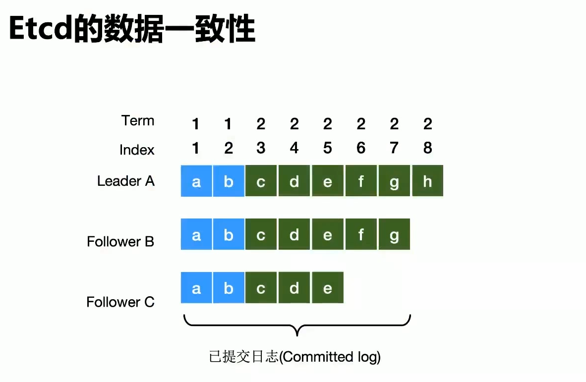

# 数据同步


## walLog

`walLog` 是二进制的，解析之后是个数据结构 `LogEntry`

- `type`
  - 0 Normal
  - 1 ConfChange
- `term`
  - 这条日志是第几个任期的
- `index`
  - 递增的序号
- `data`
  - 二进制 data


## 存储机制

- 内存索引 `kv index`
  - `btree`
- 后端存储 `boltdb`
  - `key` -> `reversion`
  - `value` -> `etcd.key` `etcd.value`
  - `etcd` 会在 `boltdb` 中把每个版本保存下来 实现多版本机制
  - 需要向客户端告知修改了什么 变成了什么





```shell
etcdctl put b v1
#OK
etcdctl get b -wjson
#{
#  "header": {
#    "cluster_id": 17478742799590499669,
#    "member_id": 14532165781622267127,
#    "revision": 8,
#    "raft_term": 3
#  },
#  "kvs": [
#    {
#      "key": "Yg==",
#      "create_revision": 8,
#      "mod_revision": 8,
#      "version": 1,
#      "value": "djE="
#    }
#  ],
#  "count": 1
#}
```


`reversion` 是 `etcd` 全局变量 做出任何修改的时候 `reversion` 增加

`create_revision` 创建的时候 `reversion` 是什么

`mod_revision` 修改的时候 `reversion` 是什么

`version` 当前这个值的版本

```shell
etcdctl put b v2
#OK
etcdctl get b -wjson
#{
#  "header": {
#    "cluster_id": 17478742799590499669,
#    "member_id": 14532165781622267127,
#    "revision": 9,
#    "raft_term": 3
#  },
#  "kvs": [
#    {
#      "key": "Yg==",
#      "create_revision": 8,
#      "mod_revision": 9,
#      "version": 2,
#      "value": "djI="
#    }
#  ],
#  "count": 1
#}
```


```shell
etcdctl get b --rev=0
#b
#v2
etcdctl get b --rev=8
#b
#v1
```


### 预检查
step1

认证 鉴权 配额 限速 包大小（限制，如果大于限制则拒绝掉）

### KVServer

step2

接收到请求之后把数据包发送到一致性模块

step4

收到一致性模块的 `Ready` 之后 发送到 `follower`
- Input:MsgApp
- Output:MsgAppResp

step5

接收 `Follower` 判断是否超过半数的确认

如果超过 `raftLog` 变成 `committed` 然后

更新 `MatchIndex`

执行 `apply` 操作 `MVCC` 模块（多版本并发控制）


### 一致性模块

step3

接受数据请求 执行 存入到 `unstable` 中

Propose()
- Input:MsgProp{put y <- 9}
- Output:Ready

- 选主
- 日志复制
- raftLog(Mem)
  - unstable
  - committed
  - applied


### MsgApp

step4

写 `WAL` 日志

`walLog` 和 `raftLog` 不同 

`walLog` 是一个二进制的 需要把数据进行序列化

`walLog` 不稳定 需要 `fsync` 会落盘

`walLog` 本身是读不到的


### MVCC

#### treeIndex

- key
  - etcd.key eg y
- modified 当前版本
  - reversion eg <4,0>
- generations 历史版本
  - eg [{ver:1,created:<3,0>,reversion:[<3,0>,<4,0>]}]


#### BoltDB

b+tree

- key
  - <4,0>
- value
  - {key:y,create_version:<3,0>,mod_reversion:<4,0>,version:2,value:9}


## ETCD 数据一致性如何保证




