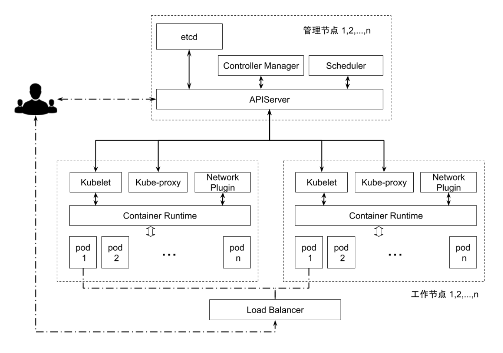

# etcd in kubernetes

```shell
ks get po kube-apiserver-master -oyaml

#spec:
#  containers:
#  - command:
#    - kube-apiserver
#    - --advertise-address=192.168.34.101
#    - --allow-privileged=true
#    - --authorization-mode=Node,RBAC
#    - --client-ca-file=/etc/kubernetes/pki/ca.crt
#    - --enable-admission-plugins=NodeRestriction
#    - --enable-bootstrap-token-auth=true
#    - --etcd-cafile=/etc/kubernetes/pki/etcd/ca.crt
#    - --etcd-certfile=/etc/kubernetes/pki/apiserver-etcd-client.crt
#    - --etcd-keyfile=/etc/kubernetes/pki/apiserver-etcd-client.key
#    - --etcd-servers=https://127.0.0.1:2379

# 启动参数
# apiserver 作为 etcd 的客户端
```


```shell
ks exec -it etcd-master -- /bin/sh
ETCDCTL_API=3
alias ectl='etcdctl --endpoints https://127.0.0.1:2379 \
  --cacert /etc/kubernetes/pki/etcd/ca.crt \
  --cert /etc/kubernetes/pki/etcd/server.crt \
  --key /etc/kubernetes/pki/etcd/server.key'
  
ectl member list
ectl get --prefix --keys-only /
# /registry/roles/kube-system/system:controller:token-cleaner
```


```shell
ks get role system:controller:token-cleaner -oyaml
```


### 故障处理

`apiserver` 只能一个一个操作 不支持批次操作 如果自己的控制器写出来 `bug`

导致创建了多个对象

此时 `apiserver` 已经无法响应

需要进入到 `etcd` 中 手动删除


### etcd 在集群中所处的位置



一般来说只有 `apiserver` 与 `etcd` 链接

其他组件如果想有数据库 需要自己维护自己的 `etcd`


在 `kubernetes` 中有一些不是很重要的数据 比如 `event`

不让他占用大量的 `etcd` 操作 可以使用

```shell
# apiserver 启动参数
# 把请求转发给副 etcd
--etcd-servers-overrides=/events#https://localhost:4002
```


## etcd 集群高可用 最佳实践

`etcd` **出问题是非常严重的后果**

**场景一**：集群中的很多 `IP` 分出去了 都是很重要的应用
此时 `etcd` 出问题了 集群并不知道哪些 `IP` 分出去了 
会出现 `IP` 复用的问题

peer数量：
- 3个
  - 性能更好
  - 如果出问题 需要运维立马上线解决
  - 如果坏了两个 变成了只读集群
- 5个
  - 坏了2个 没问题
  - 对运维的要求不高
  - 牺牲性能 对运维健康好一点

一般来说 生产集群都用 `5` 个

`etcd` 规划好多少个就是多少个 很少动态扩容和缩容

**场景二**：`10000` 个 `pod` 一次的 `list` 操作返回的数据大概超过 `100MB`
在 `k8s` 中 `apiserver` 与 `etcd` 的链接是一个 `group` 复用链接
在大约 `5000` 个节点上都有一个 `DaemonSet` 每分钟进行一次 `list` 操作
`list` 设置不相信 `apiserver` 的 `cache`
这样 `apiserver` 在每分钟都会收到 `5000`次 `list` 请求

结果是：`apiserver` 负载剧增 可能导致 `apiserver` 和 `etcd` 过载 甚至崩溃


**代码就不应该去** `list` `pod`


### 存储最佳实践

使用 `localSSD` 确保写的性能 使用专有磁盘

默认 `2G`

### 减少网络延迟

建议 `etcd` 同地域部署加备份

可以使用 `Traffic Control` 控制网络流量优先级 让 `etcd` 的先过


### etcd 陷阱

- 磁盘暴涨 -> 不停的做 `snapshot`
- 与 `apiserver` 之间链路阻塞 -> `DaemonSet` `list` `pod`
- `etcd` 分裂 -> `4 local 1 remote` 认为数据更新可以跟得上 就不用做备份了 但是 `remote` 慢
- 频繁 `leader election`


### apiserver 自杀机制

如果部分 `etcd` 失效 链接这个 `etcd` 的 `apiserver` 
应该设置相应的探活机制 探测 `etcd` 的功能响应
如果不响应 即 `etcd` 失效 应该设置自杀

**优雅终止非常重要**


## 除非必要，否则一定一定不要进入ETCD动数据
## 除非必要，否则一定一定不要进入ETCD动数据
## 除非必要，否则一定一定不要进入ETCD动数据


