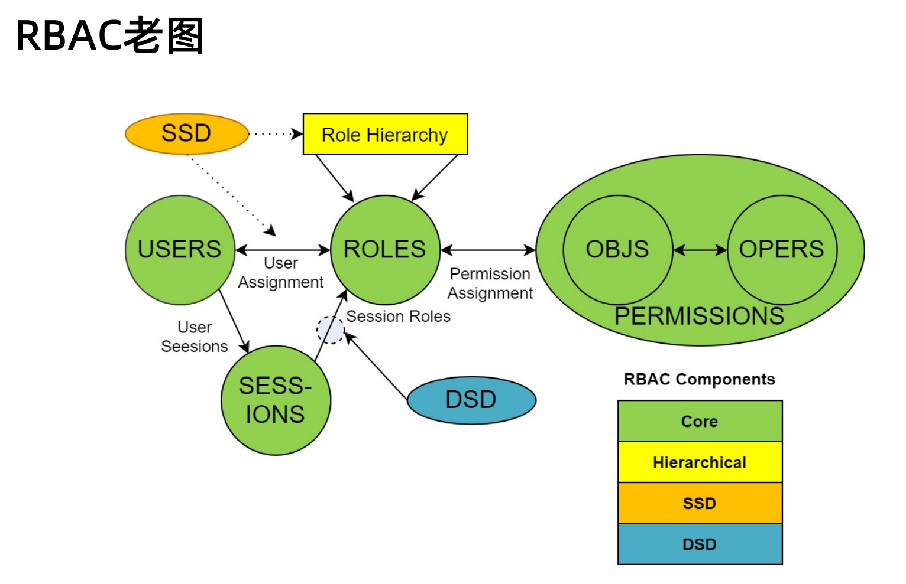
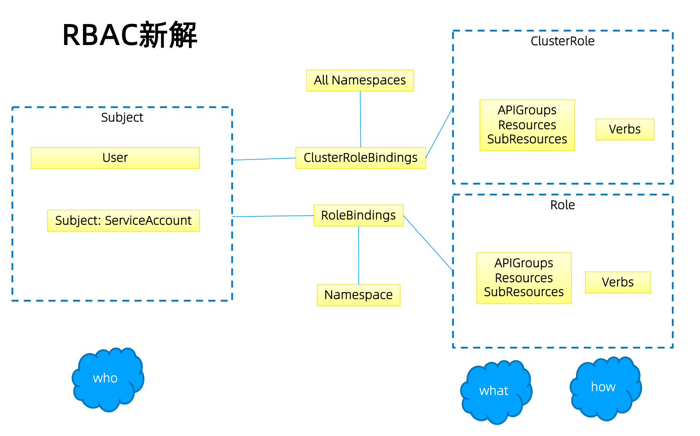
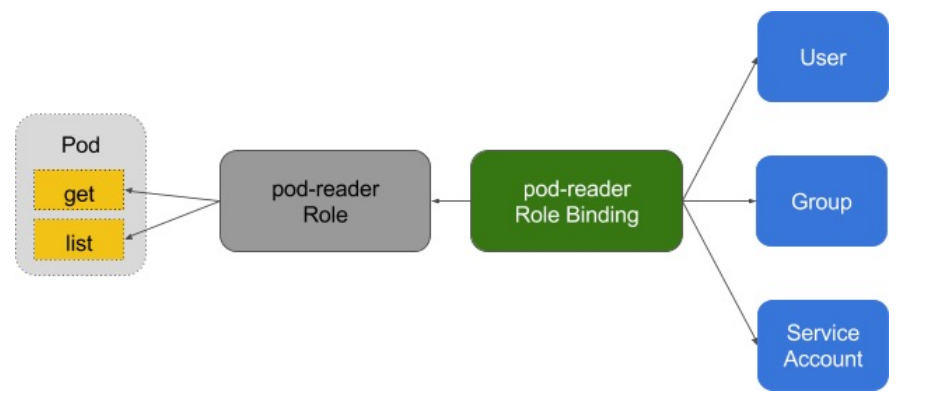

# 鉴权 授权


## 授权

- ABAC
- RBAC
- Webhook
- Node -> 节点的 kubelet 不能操作其他 node 的资源


### RBAC








- `Role`
  - 定义在某个 `Namespace` 下的
- `ClusterRole`
  - 集群范围内授权给其他用户

认证系统是能够识别该用户属于哪一个组 `Group` 的，
所以在 `RBAC` 中组的概念应该交给认证系统去组织

授权是基于 `Namespace` 的，
所以授权的前提是规划好 `Namespace`


## Role 与 ClusterRole

> Role 是一系列权限的合集 例如一个角色可以包含读取 `pod` 的权限和列出 `pod` 的权限
> Role 只能给某个特定的 `Namespace` 中的资源作鉴权

> ClusterRole 是面对整个集群的权限合计

```yaml
kind: Role
apiVersion: rbac.authorization.k8s.io/v1
metadata:
  namespace: default
  name: pod-reader
rules:
- apiGroups: [""]
  resources: ["pods"]
  verbs: ["get", "watch", "list"]
```
```yaml
kind: ClusterRole
apiVersion: rbac.authorization.k8s.io/v1
metadata:
  # "namespace" omitted since ClusterRoles are not namespaced
  name: secret-reader
rules:
- apiGroups: [""]
  resources: ["secrets"]
  verbs: ["get", "watch", "list"]
```

## binding



```yaml
kind: RoleBinding
apiVersion: rbac.authorization.k8s.io/v1
metadata:
  name: read-secrets
  namespace: default  # 权限只在 default 命名空间内生效
subjects:
- kind: User  # Group 授权给某个组
  name: example-user  # 被授予权限的用户
  apiGroup: rbac.authorization.k8s.io
roleRef:
  kind: ClusterRole
  name: secret-reader  # 引用的 ClusterRole
  apiGroup: rbac.authorization.k8s.io
```
> 即使绑定的是 `ClusterRole` 但是 由于是 `RoleBinding`
> 必须指定在哪一个 `Namespace` 里
> 所以这个授权绑定是有 `Namespace` 限制的
> `ClusterRole` 也可以用于为单个命名空间中的资源授予权限
> 如果你希望这个 `ClusterRole` 的权限在整个集群范围内生效，应该使用 `ClusterRoleBinding` 而不是 `RoleBinding`

```yaml
kind: ClusterRoleBinding
apiVersion: rbac.authorization.k8s.io/v1
metadata:
  name: read-secrets-global
subjects:
- kind: User
  name: example-user
  apiGroup: rbac.authorization.k8s.io
roleRef:
  kind: ClusterRole
  name: secret-reader  # 引用 ClusterRole
  apiGroup: rbac.authorization.k8s.io

```
> 在这种情况下，`ClusterRoleBinding` 没有 `Namespace` 限制，
> `example-user` 将具有集群范围内的权限 可以在所有命名空间中获取 `secrets` 资源


**总结**：
- `RoleBinding`：只能在一个命名空间内生效，并且必须指定 `Namespace`
- `ClusterRoleBinding`：跨命名空间生效，适用于整个集群的权限管理，不需要指定 `Namespace`


## 规划系统角色

- `User`
  - 管理员
    - 管理整个集群所有资源？？
    - `Secret` 存用户业务的 密码 Token 等不应该让管理员管理
    - 需要取消对 `Secret` 的管理权限
  - 普通用户
    - 管理员授予权限 做自组织
    - `Namespace` 做天然隔离
    - 对其他的 `Namespace` 是否 可读 可写
    - 这个只是不能读写 那么业务能否访问呢？能的 业务的隔离后面说
- `SystemAccount`
  - `SystemAccount` 是开发者（kubernetes developer domain developer）创建应用后 应用于 `apiserver` 通讯需要的身份
  - 用户可以创建自定的 `SystemAccount` `kubernetes` 也为每个 `Namespace` 创建 `default SystemAccount`
  - `default SystemAccount` 通常需要给定权限以后才能对 `apiserver` 做写操作 默认没有任何权限


**如何实现多租户系统？**
> 每个用户在创建一个 `Namespace` 的时候 这个 `Namespace` 就天然归属于他 自动给权限

- `Admission Controller` 负责注入信息
  - 当用户发起创建 `Namespace` 的请求时，`Admission Controller` 负责拦截请求，并对 `Namespace` 的请求进行变更，例如为 `Namespace` 添加注释，记录该 `Namespace` 的创建者信息。
  - `Admission Controller` 不会直接创建 `Role`，它只是在处理 `Namespace` 创建请求时，注入相关的用户和租户信息（例如通过 `annotation` 来标识 `Namespace` 创建者）。
- `RBAC Controller` 负责处理权限分配
  - `RBAC Controller` 负责监听 `Namespace` 的创建事件。当 `Namespace` 创建成功后，`RBAC Controller` 会监听到这个事件，然后在此时进行角色和权限的分配。
  - 这个时候，`RBAC Controller` 才会为该 `Namespace` 动态创建 `Role` 和 `RoleBinding`，并绑定到 `Namespace` 创建者上。
- `Role` 和 `RoleBinding` 的动态生成与分配
  - 动态创建 `Role`：为这个 `Namespace` 创建一个新的 `Role`，如 `namespace-creator`，并定义相关的操作权限（如创建 `Pod`、`Service` 等）。
  - 动态生成 `RoleBinding`：将这个 `Role` 绑定到创建 `Namespace` 的用户上，使用户能够在该 `Namespace` 内执行相关操作。


#### 权限相关的其他最佳实践

- `ClusterRole` 是非 `Namespace` 绑定的 针对整个集群生效
- 通常需要一个管理员角色 绑定到开发运维团队成员
- `CRD` 是全局资源 普通用户创建之后需要管理员授予相应的权限才能真正的操作对象
- 针对所有的角色管理 建议创建 `spec` 用源代码驱动 不要直接在 `kubernetes` 系统上修改
- 权限可以传递
- 防止海量的角色和角色绑定对象 大量的对象导致鉴权效率降低


#### 运营过程中出现的陷阱

- 案例1
  - `replace(update)` 和 `apply(patch)`
  - `replace` 会把对象的所有信息都发送到 `apiserver`
  - `apply` 会在客户端做一个比对 新对象和老对象的差异生成一个 `json patch` 发送到 `apiserver`
  - 研发人员为了提高系统效率 把 `update` 改成 `patch`
  - 本地安全测试环境测试通过（权限松散）
  - 上生产发现不工作
  - 原因：没有及时更新 `RoleBinding` 只有 `update` 权限 没有 `patch` 权限
- 案例2
  - 研发人员创建 `CRD` 并针对 `CRD` 编程
  - 上生产不工作
  - 原因：该 `CRD` 未授权 对应的组件 `get` 不到对应的 `CRD` 资源


