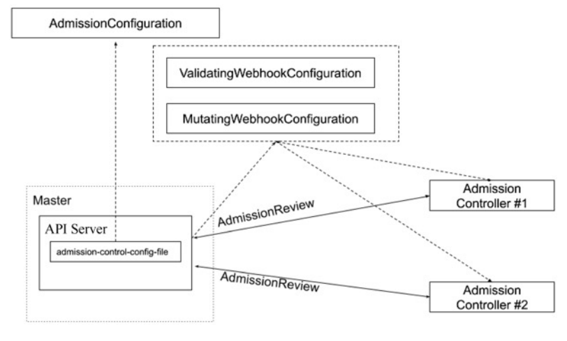

# 准入

**为资源增加自定义属性**

> 作为多租户集群方案中的一环，我们需要在 `namespace` 的准入控制中，获取用户信息，并将用户信息更新到 `namespace` 的 `annotation`

> 只有当 `namespace` 中有有效用户信息时，我们才可以在 `namespace` 创建时，自动绑定用户权限，`namespace` 才可用。


**配额管理**
- 资源有限 如何限定某个用户可用多少资源

**方案**
- 预定义每个 `namespace` 的 `ResourceQuota` 并把 `spec` 保存为 `configmap`
  - 用户可以创建多少个 `pod`
    - `BestEffortPod`
    - `QoSPod`
  - 用户可以创建多少个 `service`
  - 用户可以创建多少个 `ingress`
  - 用户可以创建多少个 `service VIP`
- 创建 `resourceQuotaController`
  - 监控 `namespace` 创建事件 当 `namespace` 创建时 在该 `namespace` 创建对应的 `ResourceQuota` 对象
- `apiserver` 中开启 `ResourceQuota` 的 `admission plugin`

> 这样和用户自定义 `namespace` 时候自动获取 `namespace` 权限一样 自动化处理

```shell
# 限制配额
k create -f quota.yaml

k get resourcequota
#NAME            AGE   REQUEST           LIMIT
#object-counts   78s   configmaps: 2/2

k create configmap aaa --from-file quota.yaml 
#error: failed to create configmap: configmaps "aaa" is forbidden: 
#exceeded quota: object-counts, requested: configmaps=1, used: configmaps=2, limited: configmaps=2
```


```yaml
# quota.yaml
apiVersion: v1
kind: ResourceQuota
metadata:
  name: object-counts
  namespace: default
spec:
  hard:
    configmaps: "2"
```


### 准入控制插件

- AlwaysPullImages
  - 多租户场景非常有用
- IfNotPresent
  - 如果是不规范的流水线公司
  - 会把同一个 `tag` override
  - 即两个版本的代码对应的同一个镜像版本
  - 此时如果是 `IfNotPresent` 新的镜像不会被拉取 必须强制拉取
- Always
  - 存在大量的网络开销
  - 镜像仓库压力较大


```shell
# 查看哪些默认开启
ks exec -it kube-apiserver-master -- kube-apiserver --help
#--enable-admission-plugins strings                                         
#        admission plugins that should be enabled in addition to default
#        enabled ones (NamespaceLifecycle, LimitRanger, ServiceAccount,
#        TaintNodesByCondition, PodSecurity, Priority,
#        DefaultTolerationSeconds, DefaultStorageClass,
#        StorageObjectInUseProtection, PersistentVolumeClaimResize,
#        RuntimeClass, CertificateApproval, CertificateSigning,
#        ClusterTrustBundleAttest, CertificateSubjectRestriction,
#        DefaultIngressClass, MutatingAdmissionWebhook,
#        ValidatingAdmissionPolicy, ValidatingAdmissionWebhook,
#        ResourceQuota). Comma-delimited list of admission plugins:
#        AlwaysAdmit, AlwaysDeny, AlwaysPullImages, CertificateApproval,
#        CertificateSigning, CertificateSubjectRestriction,
#        ClusterTrustBundleAttest, DefaultIngressClass, DefaultStorageClass,
#        DefaultTolerationSeconds, DenyServiceExternalIPs, EventRateLimit,
#        ExtendedResourceToleration, ImagePolicyWebhook,
#        LimitPodHardAntiAffinityTopology, LimitRanger,
#        MutatingAdmissionWebhook, NamespaceAutoProvision, NamespaceExists,
#        NamespaceLifecycle, NodeRestriction,
#        OwnerReferencesPermissionEnforcement, PersistentVolumeClaimResize,
#        PersistentVolumeLabel, PodNodeSelector, PodSecurity,
#        PodTolerationRestriction, Priority, ResourceQuota, RuntimeClass,
#        ServiceAccount, StorageObjectInUseProtection, TaintNodesByCondition,
#        ValidatingAdmissionPolicy, ValidatingAdmissionWebhook. The order of
#        plugins in this flag does not matter.
```

## 准入插件开发




- `MutatingWebhookConfiguration`：变形插件，支持对准入对象的修改
- `ValidatingWebhookConfiguration`：校验插件，只能对准入对象合法性进行校验，不能修改

> authn-webhook中使用 `tokenReview` 在这里也是一样 遵循了一个 `admissionReview`


- 一但配置了 `mutating webhook` 如果 `mutating` 服务挂了 `apiserver` 对于这种请求会 `timeout` 掉
- 可以针对不同的 `namespace` 做不同的 `mutating` 操作
- `admission mutating webhook` 是动态挂载
- `webhook` 一般也是部署在 `k8s` 中


```log
# 演示使用 mutating 操作修改属性
/mutatingwebhook
```


