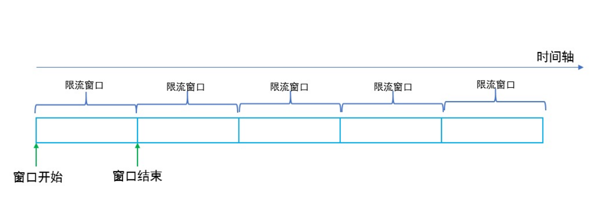
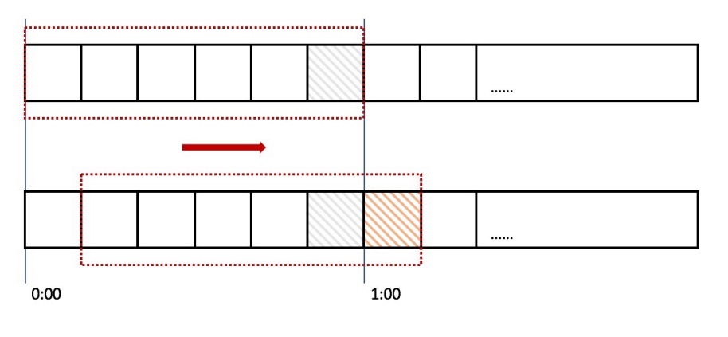
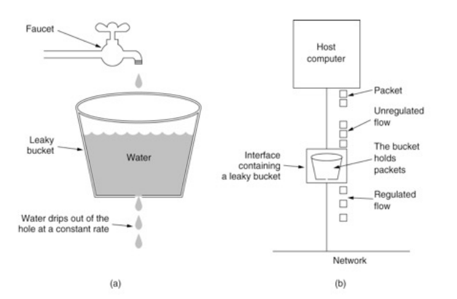
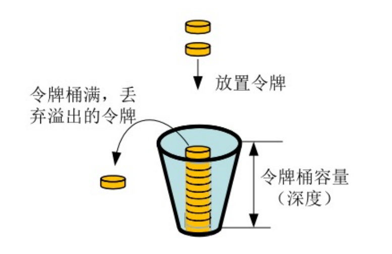
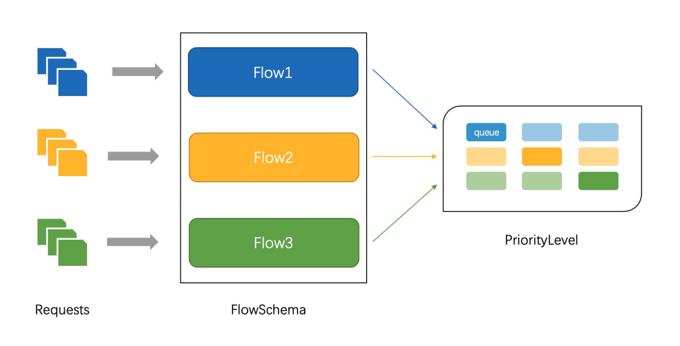
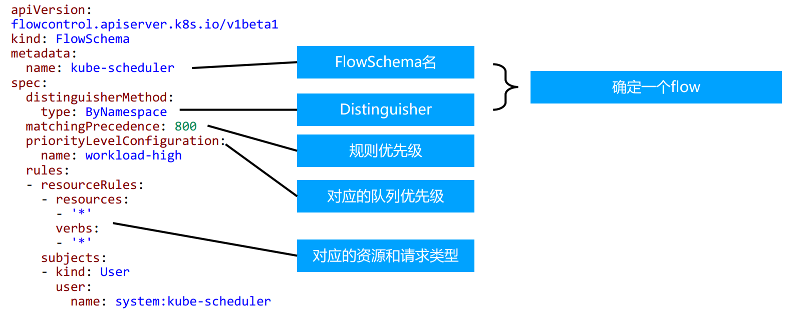
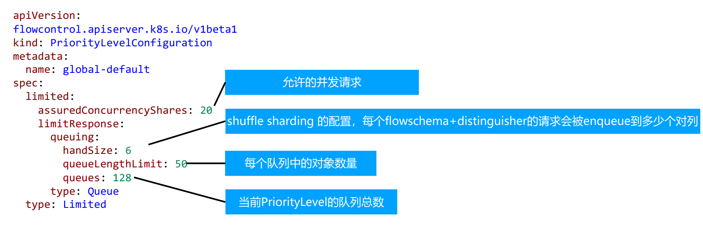

# 限流

一个系统的限流如何做

### 计数器固定窗口算法

对固定时间窗口内的请求计数，如果请求超过了阈值，则舍弃该请求。
如果没有达到阈值，接受该请求，计数加一。

时间窗口结束，重置计数器

问题：限流时间窗口最后时间大量请求 但是其他时间没有请求 就有问题

### 计数器滑动窗口算法

优点：降低了瞬时大量请求把系统压死的可能

缺点：如果请求来的更急 也是会遇到这个问题

### 漏斗算法

请求来了之后进入漏斗，然后漏斗以恒定的速率把请求流出进行处理，从而起到平滑流量的作用。

不限制进漏斗的速度 但是达到最大值会溢出 此时把请求抛弃

从漏斗出是限速的 以固定速度从漏斗向外漏

在系统看来，请求永远都是以平滑的传输速度传过来，从而起到保护系统的作用。

缺点：大量并发的请求过来 可能一部分的请求会直接丢掉 没有对高峰请求的支持

### 令牌桶算法

## apiserver 中的限流

- `max-requests-inflight` 定义 `apiserver` 能够处理多少的并发请求 默认 `400`
  - 节点数 `1000-3000` 建议设置为 `1500`
  - 节点数 `>3000 ` 建议设置为 `3000`
- `max-mutating-requests-inflight` 写操作的最大并发请求 默认 `200`
  - 节点数 `1000-3000` 建议设置为 `500`
  - 节点数 `>3000` 建议设置为 `1000`

#### 传统限流方法的局限性
- 粒度粗
  - 无法为不同的用户不同场景设置不同的限流
- 单队列
  - 共享队列/桶 一个坏用户可能会将整个系统堵塞
  - `calico` 有个 `daemonSet` 没有遵循 监听大于轮询原则
  - 会向 `apiserver` `list` `pod` 把整个 `apiserver` 压死
- 不公平
  - 正常用户的请求会被排到队尾 无法及时处理而饿死
- 无优先级
  - 重要的指令一同被限流 系统故障难以恢复

### API Priority and Fairness

- `APF` 的实现依赖两个非常重要的资源 `FlowSchema` `PriorityLevelConfiguration(PLC)`
- `APF` 对每一个请求进行更细粒度的分类 每一个请求对应一个 `FlowSchema`
- `FlowSchema` 内的请求又会根据 `distinguisherMethod` 进一步划分为不同的 `Flow`
- `FlowSchema` 会设定一个优先级 `PLC` 不同优先级的并发资源是隔离的
- 一个 `PLC` 可以对应多个 `FlowSchema` 
- `PLC` 中维护一个 `QueueSet` 用于缓存不能及时处理的请求 请求不会因为超过 `PLC` 的并发限制而被丢弃

### 概念

- 传入的请求通过 `FlowSchema` 按照其属性性分类，并分配优先级。
- 每个优先级维护自定义的并发限制，强化了隔离度，这样不同优先级的请求，就不会相互饿死。
- 在同一个优先级内，公平排队算法可以防止来自不同 `Flow` 的请求相互饿死。
- 该算法将请求排队，通过排队机制，防止在平均负载较低时，通信量突增而致请求失败。

### 优先级

- 如果未启用 `APF`，`API` 服务器中的整体并发量将受到 `kube-apiserver` 的参数 `--max-requests-inflight` 和 `--max-mutating-requests-inflight` 的限制。
- 启用 `APF` 后，将对这些参数定义的并发限制进行求和，然后将总和分配到一组可配置的优先级中。每个传入的请求都会分配一个优先级；
- 每个优先级都有各自的配置，设定允许分发的并发请求数。
- 例如，默认配置包括针对于领导者选举请求，内置控制器请求和 `Pod` 请求都单独设置优先级。这表示即使异常的 `Pod` 向 `API` 服务器发送大量请求，也无法阻止领导者选举或内置控制器的操作执行成功。

### 排队

- 即使在同一优先级内，也可能存在大量不同的流量源。
- 在过载情况下，防止一个请求流饿死其他流是非常有价值的（尤其是在一个较为常见的场景中，一个有故障的客户端会疯狂地向 `kube-apiserver` 发送请求，理想情况下，这个有故障的客户端不应对其他客户端产生太大的影响）。
- 公平排队算法在处理具有相同优先级的请求时，实现了上述场景。
- 每个请求都被分配到某个 `Flow` 中，该流由对应的 `FlowSchema` 的名字加上一个流区分项 `distinguisherMethod` 来标识。
- 这里的流区分项可以是发出请求的用户、目标资源的名称空间或什么都不是。
- 系统尝试为不同流中具有相同优先级的请求赋予近似相等的权重。
- 将请求划分到流中之后，`APF` 功能将请求分配到队列中。
- 分配时使用一种称为 **混洗分片** `Shuffle-Sharding` 的技术。该技术可以有效地利用队列隔离低强度流与高强度流。
- 排队算法的细节可针对每个优先级进行调整，并允许管理员在内存占用、公平性（当总流量超标时，各个独立的流将会取得进展）、突发流量的容忍度以及排队引发的额外延迟之间进行权衡。

### FlowSchema

如何对请求分类 定义一个流以及这个流应该去哪个 `PriorityLevelConfiguration`

### PriorityLevelConfiguration

定义队列的优先级 以及一个队列能放多少个流

`PriorityLevelConfiguration` `FlowSchema` 是一对多的关系

