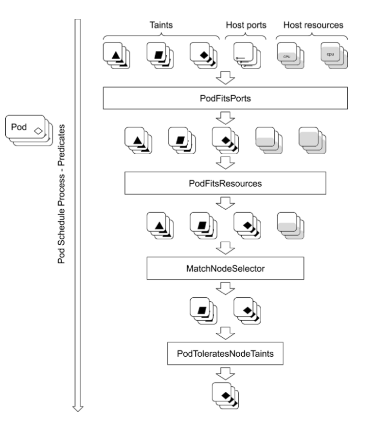

kubernetes 三大功能
- 集群管理
- 资源调度
- 服务发现


# 调度

## 调度器

- `Predicate`：过滤不符合条件的节点
- `Priority`：优先级排序 对过滤后的节点打分

### Predicates 策略
- `PodFitsHostPorts`
  - pod 需要在主机上映射一个端口 检查是否有 `host ports` 冲突
- `PodFitsResources`
  - 检查 `node` 资源是否充足
- `HostName`
  - `pod.Spec.NodeName` 是否与候选节点一致 可以指定节点
- `MatchNodeSelector`
  - 检查节点是否匹配 `pod.Spec.NodeSelector`
  - `label filter`
- `MatchInterPodAffinity`
  - 检查是否匹配 pod 亲和性
- `PodToleratesNodeTaints`
  - 检查 `pod` 是否容忍 `Node Taints`
- 未完待续




### Priority 策略

- `SelectorSpreadPriority`
  - 优先减少节点上属于同一个 `Service` 或 `ReplicationController` 的 `pod` 数量
- `InterPodAffinityPriority`
  - 优先将 `pod` 调度到相同的拓扑上
- 未完待续

## 资源需求


- `requests`
  - 调度器需要参考的需求
  - `cpu.shares`
  - `cpu*1024` 相对值
  - `cpu.shares` 是在共同抢 `cpu` 时间片的时候的相对值
  - 100m -> 102
- `limits`
  - 应用最多用多少资源
  - `cpu.cfs_period_us`
  - `cpu.cfs_quota_us`
  - 确定进程的资源使用上限
  - 如果都是 `100000` 则说明该进程最多使用 1 个 `cpu`

  

```shell
# 节点资源
k get no -oyaml

#    allocatable:
#      cpu: "4"
#      ephemeral-storage: "10836873199"
#      hugepages-2Mi: "0"
#      memory: 8033764Ki
#      pods: "110"
#    capacity:
#      cpu: "4"
#      ephemeral-storage: 11758760Ki
#      hugepages-2Mi: "0"
#      memory: 8136164Ki
#      pods: "110"
```

```shell
k apply -f nginx-deployment.yaml
```
```yaml
# nginx-deployment
apiVersion: apps/v1
kind: Deployment
metadata:
  name: nginx-deployment
spec:
  replicas: 1
  selector:
    matchLabels:
      app: nginx
  template:
    metadata:
      labels:
        app: nginx
    spec:
      containers:
        - name: nginx
          image: nginx
          resources:
            limits:
              memory: 1Gi
              cpu: 1
            requests:
              memory: 256Mi
              cpu: 100m
```
```shell
# 查看容器的资源限制
crictl ps
#CONTAINER           IMAGE               CREATED             STATE               NAME                      ATTEMPT             POD ID              POD
#f88339dc81640       dde0cca083bc7       2 minutes ago       Running             nginx                     0                   36f3f0f9667f1       nginx-deployment-694cb9cbf8-fsdb2

crictl inspect f88339dc81640
#cgroupsPath": 
#    "kubepods-burstable-pod146d531b_5b19_45bb_9893_f2ba9d1e014b.slice:cri-containerd:f88339dc816404080ab6756c6ef98d6c03bec5ce9df26a563b9be1c1f6c44f4a

cd /sys/fs/cgroup/cpu/kubepods.slice/kubepods-burstable.slice
cd kubepods-burstable-pod146d531b_5b19_45bb_9893_f2ba9d1e014b.slice/
cat cpu.shares
#102
```


```shell
# 带有资源限制的调度
k delete -f nginx-deployment.yaml
#limit cpu 6
#request cpu 6

k apply -f nginx-deployment.yaml
k get po
#NAME                                READY   STATUS             RESTARTS        AGE
#nginx-deployment-5c6964cd7f-ldvgh   0/1     Pending            0               3s

k describe po nginx-deployment-5c6964cd7f-ldvgh
#Events:
#  Type     Reason            Age   From               Message
#  ----     ------            ----  ----               -------
#  Warning  FailedScheduling  34s   default-scheduler  0/3 nodes are available: 1 node(s) had untolerated taint {node-role.kubernetes.io/control-plane: }, 2 Insufficient cpu. preemption: 0/3 nodes are available: 1 Preemption is not helpful for scheduling, 2 No preemption victims found for incoming pod.
```


`Kubernetes` 将 `Pod` 分为三种不同的 `QOS` 类别，分别是 `Guaranteed`、`Burstable` 和 `BestEffort`，用于决定调度和资源回收优先级：

- `Guaranteed`
  - 定义：`Pod` 的所有容器都同时定义了 `CPU` 和内存的请求值和限制值，而且这些值相同。也就是说，容器明确声明了所需的资源，并且不会超过这些限制。
  - 特点：`Guaranteed` 级别的 `Pod` 在资源争用时优先保留其所需的资源，不会被驱逐。
  - 适用场景：适用于需要严格保障资源的关键任务应用（如数据库、关键服务）。
- `Burstable`
  - 定义：`Pod` 至少有一个容器定义了资源请求和限制，但可能它们不是完全相同的，或者有些容器只定义了资源请求值而没有设置限制值。
  - 特点：`Burstable` 的 `Pod` 有较高的调度优先级，当资源紧张时，它们可以占用超过请求值的资源（但不能超过限制值），当资源短缺时，它们会被优先驱逐，但比 `BestEffort` 类别的 `Pod` 稳定。
  - 适用场景：适合可以弹性调整资源的应用，如需要高峰期偶尔占用更多资源的应用。
- `BestEffort`
  - 定义：`Pod` 的所有容器都没有定义任何资源请求和限制值。
  - 特点：`BestEffort` 类的 `Pod` 具有最低的调度和资源保留优先级，当节点资源不足时，它们是最先被驱逐的。
  - 适用场景：适合不重要的任务或者负载较轻、对资源不敏感的应用。


### init container 资源需求

- 当 `scheduler` 调度带有多个 `init` 容器的 `pod` 时候 只计算 `cpu.request` 最多的 `init` 容器 而不是计算所有 `init` 容器总和
- 由于多个 `init` 容器按照顺序执行 并且执行完成立即退出 所以申请最多资源的 `init` 容器中的所需资源 即可满足所有的 `init` 容器需求
- `scheduler` 计算该节点被占用资源的时候 `init` 容器资源依然被纳入计算 因为 `init` 容器在特定状态下会再次执行


## 把 pod 调度到指定 node 上

- nodeSelector
- nodeAffinity
- podAffinity
- Taints&tolerations

### nodeSelector

```yaml
# node-selector.yaml
apiVersion: apps/v1
kind: Deployment
metadata:
  name: node-selector
spec:
  replicas: 1
  selector:
    matchLabels:
      app: nginx
  template:
    metadata:
      labels:
        app: nginx
    spec:
      containers:
        - name: nginx
          image: nginx:1.27.0
      nodeSelector:
        disktype: ssd
```

```shell
k create -f node-selector.yaml
k get po
#NAME                           READY   STATUS             RESTARTS      AGE
#node-selector-dfcc7b4b-ncf2v   0/1     Pending            0             33s

k describe po node-selector-dfcc7b4b-ncf2v
#Events:
#  Type     Reason            Age   From               Message
#  ----     ------            ----  ----               -------
#  Warning  FailedScheduling  2m    default-scheduler  0/3 nodes are available: 
#  1 node(s) had untolerated taint {node-role.kubernetes.io/control-plane: }, 
#  2 node(s) didn't match Pod's node affinity/selector. 
#  preemption: 0/3 nodes are available: 3 Preemption is not helpful for scheduling.

k label no node1 disktype=ssd
k get po
#NAME                           READY   STATUS             RESTARTS      AGE
#node-selector-dfcc7b4b-ncf2v   1/1     Running            0             3m38s

k describe po node-selector-dfcc7b4b-ncf2v
#Events:
#  Type     Reason            Age    From               Message
#  ----     ------            ----   ----               -------
#  Warning  FailedScheduling  3m45s  default-scheduler  0/3 nodes are available: 
#  1 node(s) had untolerated taint {node-role.kubernetes.io/control-plane: }, 
#  2 node(s) didn't match Pod's node affinity/selector. 
#  preemption: 0/3 nodes are available: 3 Preemption is not helpful for scheduling.
#  Normal   Scheduled         11s    default-scheduler  Successfully assigned default/node-selector-dfcc7b4b-ncf2v to node1
#  Normal   Pulled            10s    kubelet            Container image "nginx:1.27.0" already present on machine
#  Normal   Created           10s    kubelet            Created container nginx
#  Normal   Started           10s    kubelet            Started container nginx

# 取消 label
k label no node1 disktype-
```

但是扩展性比较差 需要打标签


### nodeAffinity

分析强亲和性和弱亲和性

```yaml
# hard-node-aff.yaml
apiVersion: apps/v1
kind: Deployment
metadata:
  name: node-aff
spec:
  replicas: 1
  selector:
    matchLabels:
      app: nginx
  template:
    metadata:
      labels:
        app: nginx
    spec:
      affinity:
        nodeAffinity:
          requiredDuringSchedulingIgnoredDuringExecution:
            nodeSelectorTerms:
              - matchExpressions:
                  - key: disktype
                    operator: In
                    values:
                      - ssd
      containers:
        - name: nginx
          image: nginx:1.27.0
```

```shell
k create -f hard-node-aff.yaml
k get po
#NAME                             READY   STATUS             RESTARTS      AGE
#node-aff-769cd5658b-pv2f8   0/1     Pending            0             33s
# 依旧是没有调度 因为没有 node 标签 disktype == ssd

k describe po node-aff-769cd5658b-pv2f8
#Events:
#  Type     Reason            Age   From               Message
#  ----     ------            ----  ----               -------
#  Warning  FailedScheduling  105s  default-scheduler  0/3 nodes are available: 
#  1 node(s) had untolerated taint {node-role.kubernetes.io/control-plane: }, 
#  2 node(s) didn't match Pod's node affinity/selector. 
#  preemption: 0/3 nodes are available: 3 Preemption is not helpful for scheduling.
```

```yaml
# soft-node-aff.yaml
apiVersion: apps/v1
kind: Deployment
metadata:
  name: node-aff
spec:
  replicas: 1
  selector:
    matchLabels:
      app: nginx
  template:
    metadata:
      labels:
        app: nginx
    spec:
      affinity:
        nodeAffinity:
          preferredDuringSchedulingIgnoredDuringExecution:
          - weight: 1
            preference:
              matchExpressions:
                - key: disktype
                  operator: In
                  values:
                    - ssd
      containers:
        - name: nginx
          image: nginx:1.27.0
```

```shell
# 弱亲和性
k apply -f soft-node-aff.yaml 
#deployment.apps/node-aff configured

k get po
#NAME                        READY   STATUS         RESTARTS      AGE
#node-aff-6f78fffd55-2d57t   1/1     Running        0             7m32s

k describe po node-aff-6f78fffd55-2d57t
#Events:
#  Type    Reason     Age    From               Message
#  ----    ------     ----   ----               -------
#  Normal  Scheduled  8m31s  default-scheduler  Successfully assigned default/node-aff-6f78fffd55-2d57t to node2
#  Normal  Pulled     8m31s  kubelet            Container image "nginx:1.27.0" already present on machine
#  Normal  Created    8m31s  kubelet            Created container nginx
#  Normal  Started    8m31s  kubelet            Started container nginx
```


### podAffinity

```yaml
# nginx-anti.yaml
apiVersion: apps/v1
kind: Deployment
metadata:
  name: nginx-anti
spec:
  replicas: 2
  selector:
    matchLabels:
      app: anti-nginx
  template:
    metadata:
      labels:
        app: anti-nginx
    spec:
      affinity:
        podAffinity:
          requiredDuringSchedulingIgnoredDuringExecution:
          - labelSelector:
              matchExpressions:
                - key: a
                  operator: In
                  values:
                    - b
            topologyKey: kubernetes.io/hostname
        podAntiAffinity:
          requiredDuringSchedulingIgnoredDuringExecution:
          - labelSelector:
              matchExpressions:
                - key: app
                  operator: In
                  values:
                    - anti-nginx
            topologyKey: kubernetes.io/hostname
      containers:
        - name: with-pod-affinity
          image: nginx:1.27.0
```

```shell
k apply -f nginx-anti.yaml
k get po
#NAME                         READY   STATUS             RESTARTS      AGE
#nginx-anti-9d7b56db5-tg7n7   0/1     Pending            0             3s
#nginx-anti-9d7b56db5-xqbtk   0/1     Pending            0             3s

k label po apphttp-5887bfd99d-ncgwx a=b
k get po
#NAME                         READY   STATUS             RESTARTS      AGE
#nginx-anti-9d7b56db5-tg7n7   1/1     Running            0             96s
#nginx-anti-9d7b56db5-xqbtk   0/1     Pending            0             96s

# 此时 有一个 pod 打上了 label 但是由于反亲和性 导致第二个 pod 无法调度
# 根据反亲和性 可以控制 deploy 的 pod 调度到不同的 node 上去
```


### Taints&tolerations

`Taints` 和 `Tolerations` 用于保证 `pod` 不被调度到不合适的 `node` 上
其中 `taint` 应用在 `node` 上 打上污点 而 `toleration` 用在 `pod` 上

key value 效果

- `NoSchedule`
  - 新的 `pod` 不该调度到该 `node` 上 不影响正在运行的 `pod`
- `PreferNoSchedule`
  - `soft` 版本的 `NoSchedule` 尽量不调度到这里
- `NoExecute` 
  - 新的 `pod` 不调度到这个 `node` 并且删除 `evict` 已经在运行的 `pod`
  - `pod` 可以增加一个时间 `tolerationSeconds`
  - 驱逐的时候有一个等待时间 就是 `tolerationSeconds`


```yaml
#每个 pod 都是默认打上这两个属性
  tolerations:
    - effect: NoExecute
      key: node.kubernetes.io/not-ready
      operator: Exists
      tolerationSeconds: 300
    - effect: NoExecute
      key: node.kubernetes.io/unreachable
      operator: Exists
      tolerationSeconds: 300
```

这就是 `kubernetes` 原生故障转移的机制，
如果一个节点打上了 `not-ready` 或者 `unreachable` 的 `taints`，
那么允许该 `pod` 存活 `tolerationSeconds` 时间，
超过这个时间再驱逐

```shell
# 打上 taint
kubectl taint nodes node1 for-special-user=master:NoSchedule

# 取消 taint
kubectl taint nodes node1 for-special-user=master:NoSchedule-
```


## 多租户的 kubernetes 集群 - 计算资源隔离


## 多调度器

`pod.Spec.schedulerName`

自定义调度器应用场景：
做一个批处理作业，需要3个并发 `pod` 一起作业，
需要一起调度，要么一起成功，要么一起失败


## 来自生产的一些经验

- 小集群
  - 
- 放大效应
  - 
- 应用炸弹
  - 


## scheduler 源码阅读


