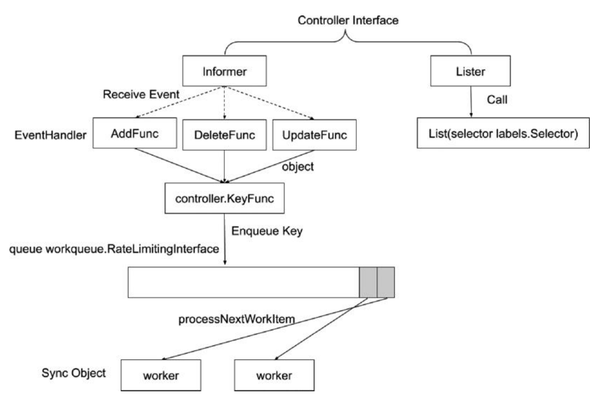
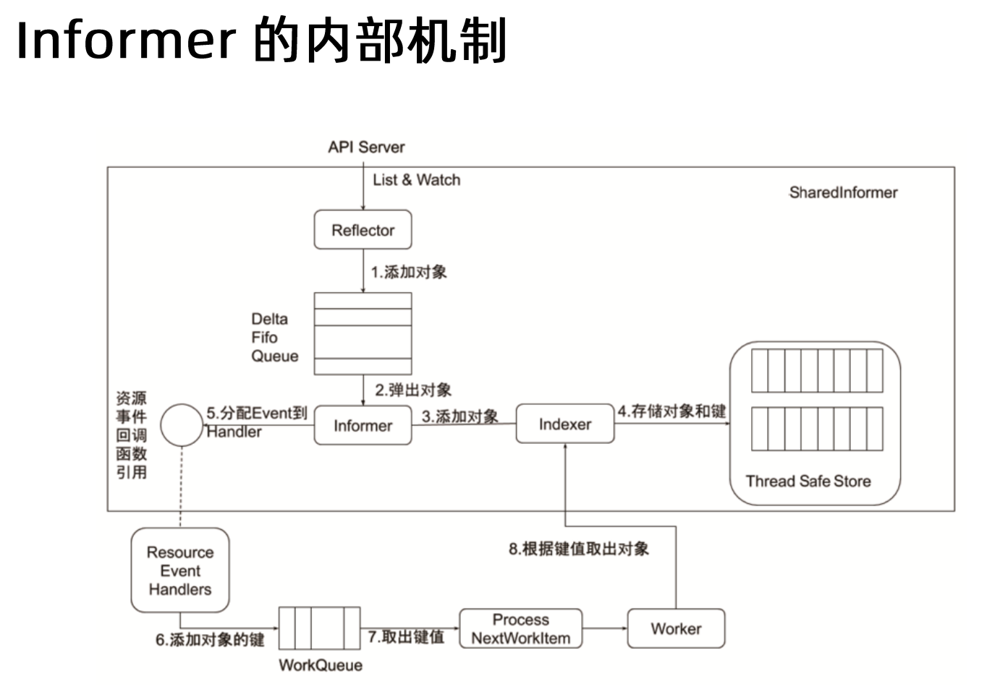
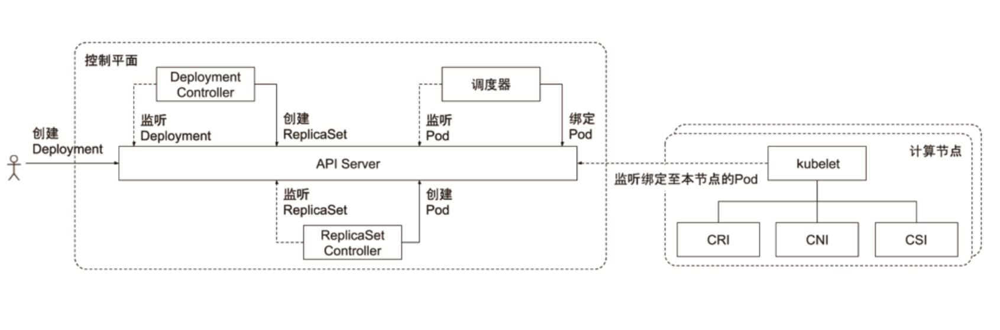

# Controller Manager







### JobController

```yaml
# job.yaml
apiVersion: batch/v1 # 属于 batch 用于批处理 临时作业
kind: Job
metadata:
  name: pi
spec:
  parallelism: 2 # 执行的时候有多少并发
  completions: 5 # 要完成多少次
  template:
    spec:
      containers:
        - name: pi
          image: perl
          command: ["perl",  "-Mbignum=bpi", "-wle", "print bpi(2000)"]
      restartPolicy: Never # kubelet 会看这个属性
```

Job 执行完成 进程已经退出了 只留下日志文件 会把资源还给调度系统 完成之后这些调度资源不会被占用了


### PodAutoScaler
横向扩展 自动扩缩容

### ReplicaSet


### StatefulSet

ReplicaSet `name + hash + rand` 不关心你是谁 只要名称不冲突

StatefulSet `name + numb(0,1,2...)` 有状态副本集 有状态应用 每个实例不一样 

```yaml
# statefulset.yaml
apiVersion: apps/v1
kind: StatefulSet
metadata:
  name: nginx-ss
spec:
  serviceName: nginx-ss
  replicas: 2
  selector:
    matchLabels:
      app: nginx-ss
  template:
    metadata:
      labels:
        app: nginx-ss
    spec:
      containers:
        - name: nginx-ss
          image: nginx:1.27.0
---
apiVersion: v1
kind: Service
metadata:
  name: nginx-ss
  labels:
    app: nginx-ss
spec:
  ports:
    - port: 80
  clusterIP: None
  selector:
    app: nginx-ss
```

```shell
k create -f statefulset.yaml 
#statefulset.apps/nginx-ss created
#service/nginx-ss created

k get po
#NAME                       READY   STATUS             RESTARTS   AGE
#nginx-ss-0                 1/1     Running            0          22s
#nginx-ss-1                 1/1     Running            0          21s

k get po nginx-ss-0 -oyaml
#hostname: nginx-ss-0
#subdomain: nginx-ss

#每个 StatefulSet 的 Pod 会有一个稳定的 DNS 名称，格式如下：
#<pod_name>.<service_name>.<namespace>.svc.cluster.local
#nginx-ss-0.nginx-ss.default.svc.cluster.local

k get svc
#NAME                       TYPE        CLUSTER-IP       EXTERNAL-IP   PORT(S)             AGE
#kubernetes                 ClusterIP   10.96.0.1        <none>        443/TCP             32d
#nginx-ss                   ClusterIP   None             <none>        80/TCP              5m25s
# 此时有一个 headless svc

k exec -it nginx-ss-0 -- /bin/sh
#ping nginx-ss-1.nginx-ss.default.svc.cluster.local
#getent hosts nginx-ss-1.nginx-ss.default.svc.cluster.local

root@nginx-ss-0:/# getent hosts nginx-ss-1.nginx-ss.default.svc.cluster.local
#10.244.166.170  nginx-ss-1.nginx-ss.default.svc.cluster.local

#nginx-ss-1 10.244.166.170
# 通过查询可以知道该 pod 的 ip 就是 10.244.166.170
```

```shell
k get sts nginx-ss -oyaml
#updateStrategy:
#    rollingUpdate:
#      partition: 0
#    type: RollingUpdate

# partition 到第几个标号分分区 升级标号小于 0 的 
# 然后人工介入修改 partition 按照上述规则继续升级
```


CSI 部分

pod有时候需要额外的存储 如何使用？

用户需要创建一个 `pvc` ，把 `pvc` 放到 `pod` 的 `template`，
`statefulSetController` 在启动这些 `pod` 的时候，
会同时按照 `pvc` 把 `vc` 创建出来，
即为每一个 `statefulSet` 创建一个外挂存储，
因为每个 `pod` 都是有状态的，
希望使用外挂存储的方式存数据


### NamespaceController


### DaemonController

```yaml
# daemonset.yaml
apiVersion: apps/v1
kind: DaemonSet
metadata:
  name: nginx-ds
spec:
  selector:
    matchLabels:
      app: nginx
  template:
    metadata:
      labels:
        app: nginx
    spec:
      containers:
        - name: nginx
          image: nginx:1.27.0
```

```shell
k create -f daemonset.yaml 
#daemonset.apps/nginx-ds created

k get po
#NAME                       READY   STATUS             RESTARTS   AGE
#nginx-ds-77p67             1/1     Running            0          4s
#nginx-ds-b6tlj             1/1     Running            0          4s

k get po -owide
#NAME               STATUS         RESTARTS   AGE     IP               NODE
#nginx-ds-77p67     Running        0          49s     10.244.166.171   node1
#nginx-ds-b6tlj     Running        0          49s     10.244.104.40    node2


```

无论是 `daemonSet` `replicaSet` `statefulSet` 都有控制版本信息来做滚动升级

controllerRevision

```shell
k get controllerRevision
#NAME                         CONTROLLER                         REVISION   AGE
#nginx-ds-bdf578756           daemonset.apps/nginx-ds            1          3m11s

k get controllerRevision nginx-ds-bdf578756 -oyaml
```


`daemonSet` 的 `toleration` 有很多 节点出现异常 `pod` 不会被驱逐 生命力强
因为 一般来说 `daemonSet` 都是基础服务


```shell
k get po nginx-ds-77p67 -oyaml
#tolerations:
#  - effect: NoExecute
#    key: node.kubernetes.io/not-ready
#    operator: Exists
#  - effect: NoExecute
#    key: node.kubernetes.io/unreachable
#    operator: Exists
#  - effect: NoSchedule
#    key: node.kubernetes.io/disk-pressure
#    operator: Exists
#  - effect: NoSchedule
#    key: node.kubernetes.io/memory-pressure
#    operator: Exists
#  - effect: NoSchedule
#    key: node.kubernetes.io/pid-pressure
#    operator: Exists
#  - effect: NoSchedule
#    key: node.kubernetes.io/unschedulable
#    operator: Exists
```

### GarbageCollector

级联删除

`ownerReferences`

当主对象删除 子对象也要删除

对于用户来说是一致的

```shell
k get po nginx-ds-77p67 -oyaml
#ownerReferences:
#  - apiVersion: apps/v1
#    blockOwnerDeletion: true
#    controller: true
#    kind: DaemonSet
#    name: nginx-ds
#    uid: e9a5a3eb-7257-4cc6-a44f-754d60102c69
```


### 生产经验

保护好 `controller manager` 的 `kubeconfig`，
不能让普通用户通过 `kubectl exec kube-controller-manager` 获取该文件，
用户可能使用超级权限做破坏操作，
找你 `support`


### scheduler controller 高可用

- `etcd` 高可用
  - `raft` 协议 选主
- `apiserver` 高可用
  - 本身是一个 `rest server` 多活 做负载均衡
- `scheduler controller`
  - 本身是控制器 高可用 也是基于选主
  - 启动多个 `scheduler` 谁配置 谁等待？
  - 如何做 `leader election`
  - 通过 `lease` 对象

```shell
ks get lease
#NAME                                   HOLDER                                                                      AGE
#apiserver-oodnacusc5bcuykzhczyk7a7zq   apiserver-oodnacusc5bcuykzhczyk7a7zq_87f43bb3-b50d-45c9-9801-c300b01e19a0   6h1m
#kube-controller-manager                master_13cc3c06-f405-4d2e-ba63-b112894d64f8                                 32d
#kube-scheduler                         master_2e059fa2-68be-408c-bb7c-84a37bd97dcf                                 32d

ks get lease kube-scheduler -oyaml
#apiVersion: coordination.k8s.io/v1
#kind: Lease
#metadata:
#  creationTimestamp: "2024-09-21T02:49:58Z"
#  name: kube-scheduler
#  namespace: kube-system
#  resourceVersion: "751792"
#  uid: 4322f450-a3cc-4386-b122-83fb12d5e5a5
#spec:
#  acquireTime: "2024-10-23T01:09:42.290683Z"
#  holderIdentity: master_2e059fa2-68be-408c-bb7c-84a37bd97dcf
#  leaseDurationSeconds: 15
#  leaseTransitions: 20
#  renewTime: "2024-10-23T07:11:53.457442Z"

```

谁取到了锁，谁就继续执行，不需要数据一致性，
所以比 `etcd` 简单，
多个 `controller manager` 只有一个在工作，
谁抢到锁，谁执行


