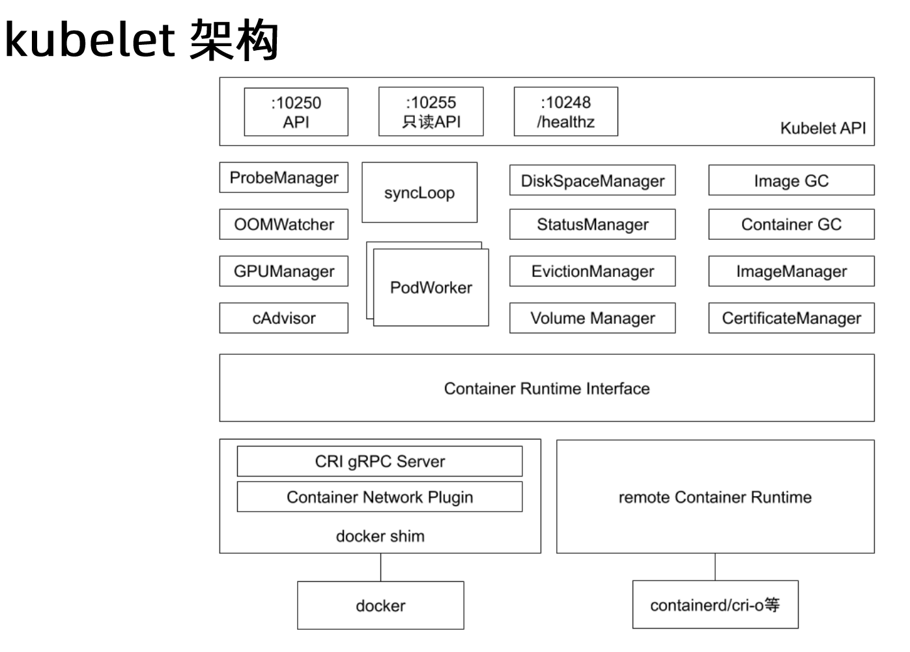
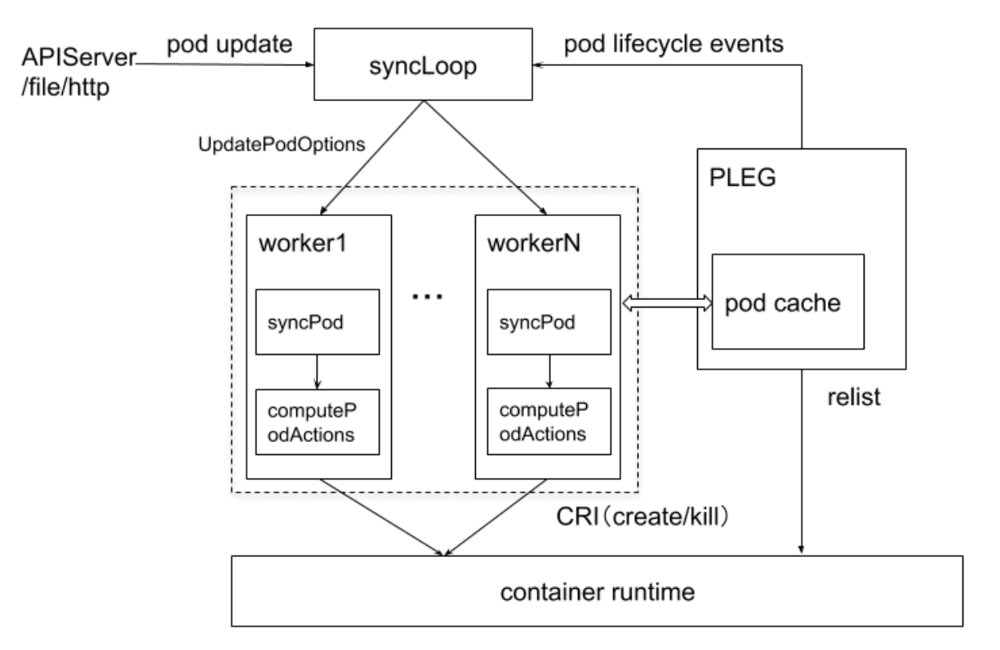
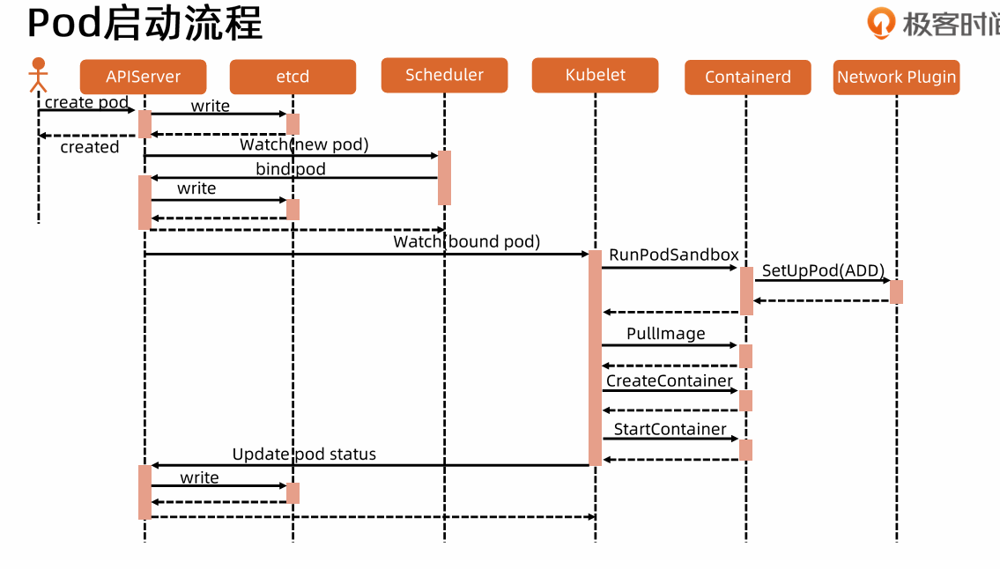
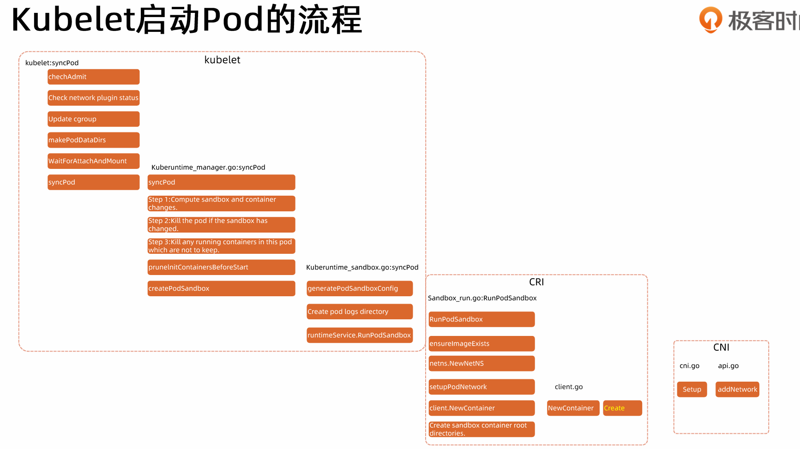

# kubelet

每个节点上都运行一个 `kubelet` 服务进程， 默认监听 `10250` 端口
- 接受并执行 `master` 发来的指令
- 管理 `pod` 以及 `pod` 中的容器
- 每个 `kubelet` 进程会在 `apiserver` 上注册节点自身信息 定期向 `master` 节点汇报资源使用情况
- 并通过 `cAdvisor` 监控节点和容器资源

`kubelet` 本身也是一个 `controller` 模式

**问题：为什么 `kubernetes` 要给每个 `node` 设置 `pod` 上限？为什么不可以跑很多的 `pod`？**

答案：不可以！因为需要 `relist` 这个动作是有开销的 需要不断发 `relist` 请求给 `runtime`
集群 `pod` 量级到了一定程度会变得复杂

### 节点管理

### Pod 管理

### Pod 启动流程

**为什么要运行一个 `sandbox`？**

所谓的 `pod` 是一组容器的组合，这组容器默认共享 `ns`，共享系统层面资源，
引入 `sandbox` 先启动一个 `pause`，
这个 `pause` 永远 `sleep` 不消耗 `cpu` 资源 并且镜像很小 极度稳定
网络的配置可以配置在这里 并且这个容器不会退出
作为整个 `pod` 的底座 把网络挂上去
同时还有 `init` 容器也需要网络配置
就是说在容器启动之前，
就已经需要有网络配置条件，
必须有网络就绪的状态，
需要先把网络挂载。
所有的网络都是配置在 `sandbox` 上的。

**kubelet:syncPod**
- checkAdmit
  - 可以在 `kubelet` 配置准入插件 当一定的条件满足之后再启动这个 `pod`
- Check network plugin status
- Update cgroup
  - `Kubelet` 了解整个节点的资源情况以及 `Kubernetes` 的调度策略
  - `kubelet` 限制资源
  - 先限制资源 再启动容器 最后加进来
- makePodDataDirs
  - 等待所有的 `volume` 就绪 比如外挂存储 `configmap` 等
  - `cni` `cri` `csi` 谁先启动？ `csi`
- WaitForAttachAndMount
- syncPod

**kuberuntime_manager.go:syncPod**
- syncPod
- step1:compute sandbox and container changes
- step2:kill the pod if the sandbox has changed
  - 如果 sandbox 改变 所有容器都要 kill
- step3:kill any running containers in this pod which are not to keep
- prunelnitContainersBeforeStart
- createPodSandbox

