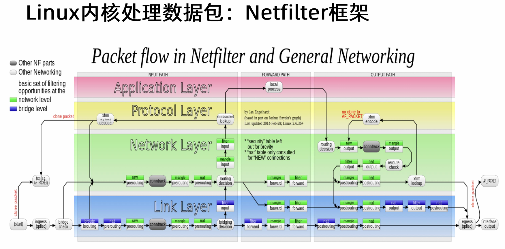
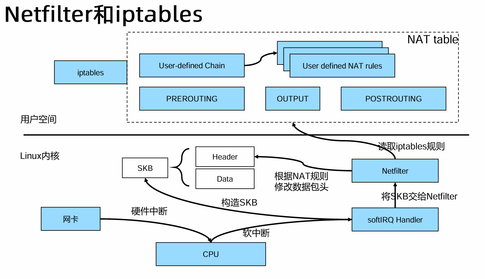
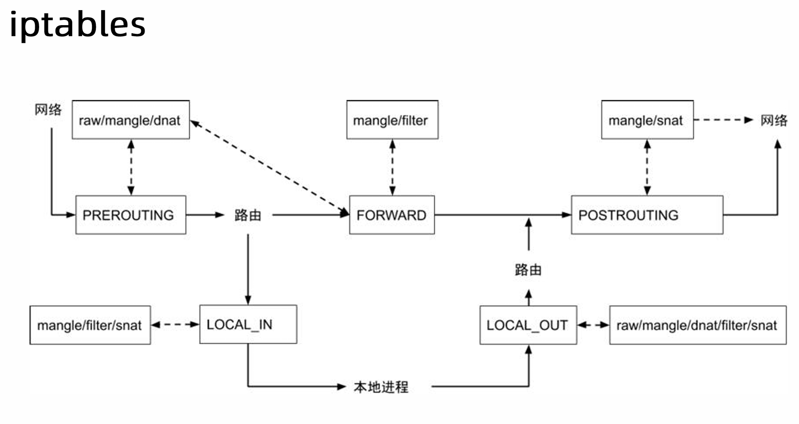
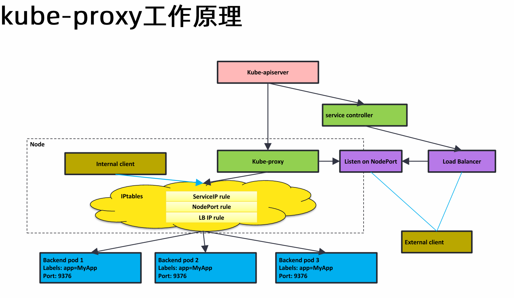
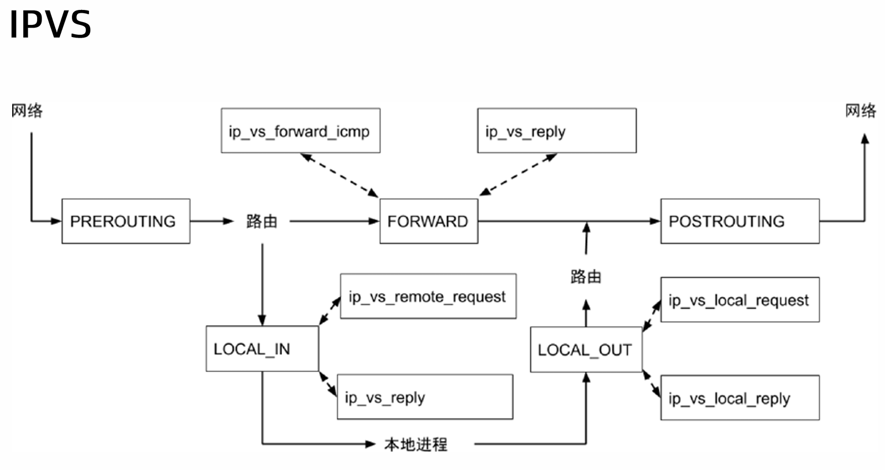

# kube-proxy


kube-proxy 是一个控制面组件，是个 loop，
不断 watch Service 和 Endpoint 对象，
所有的信息加在一起就是完整的负载均衡信息

kube-proxy 配置负载均衡

- iptables 目前推荐的方案
- ipvs 解决 iptables 性能问题


### Netfilter



- filter 防火墙规则
- nat 网络地址转换




两个配置点
- PREROUTING
  - 负责处理外部流量进入集群地址转换
  - 一般外部流量入站通过 nodePort 类型
  - 在 PREROUTING 过程做地址转换到 podIP
- LOCAL_OUT
  - 负责处理内部流量访问
  - 在出站流量处做 nat
  - 把 ClusterIP 转换为 podIP

让目标 IP 从 ClusterIP 变成 PodIP 那么这个目标就实现了，
然后通过 CNI 插件底层打通的 underlay，
转发到 Node 上，
通过 veth 发送到 pod 容器内部




### 数据面

```shell
k get svc
#NAME            TYPE        CLUSTER-IP      EXTERNAL-IP   PORT(S)        AGE
#kubernetes      ClusterIP   10.96.0.1       <none>        443/TCP        4h9m
#nginx-service   NodePort    10.100.129.52   <none>        80:30007/TCP   16s

k get po -owide
#NAME                               READY   STATUS    RESTARTS   AGE   IP               NODE    NOMINATED NODE   READINESS GATES
#nginx-deployment-576c6b7b6-bnrgk   1/1     Running   0          40s   10.244.76.11     main    <none>           <none>
#nginx-deployment-576c6b7b6-h522g   1/1     Running   0          40s   10.244.166.142   node1   <none>           <none>
#nginx-deployment-576c6b7b6-hjpkk   1/1     Running   0          40s   10.244.166.141   node1   <none>           <none>

#10.100.129.52:80 -->
#10.244.76.11:80
#10.244.166.142:80
#10.244.166.141:80

# 查看节点的所有 nat 表
iptables -L -t nat
# 插入规则
iptables-save -t nat
#-A PREROUTING -j KUBE-SERVICES
#-A OUTPUT -j KUBE-SERVICES

# KUBE-SERVICES 有很多的规则

#-A KUBE-SERVICES -d 10.100.129.52/32 -p tcp -j KUBE-SVC-V2OKYYMBY3REGZOG
# 如果目标 IP 是 10.100.129.52 tcp 协议 跳转到 KUBE-SVC-V2OKYYMBY3REGZOG

#-A KUBE-SVC-V2OKYYMBY3REGZOG ! -s 10.224.0.0/16 -d 10.100.129.52/32 -p tcp -m comment --comment "default/nginx-service cluster IP" -j KUBE-MARK-MASQ
#-A KUBE-SVC-V2OKYYMBY3REGZOG -m comment --comment "default/nginx-service -> 10.244.166.141:80" -m statistic --mode random --probability 0.33333333349 -j KUBE-SEP-NXE6VY62CSYVQDVR
#-A KUBE-SVC-V2OKYYMBY3REGZOG -m comment --comment "default/nginx-service -> 10.244.166.142:80" -m statistic --mode random --probability 0.50000000000 -j KUBE-SEP-VIK2V22DNBSZVZUM
#-A KUBE-SVC-V2OKYYMBY3REGZOG -m comment --comment "default/nginx-service -> 10.244.76.11:80" -j KUBE-SEP-O3LLHTCVM32DYQ2H

#--mode random --probability 0.33333333349 -j KUBE-SEP-NXE6VY62CSYVQDVR
# 如果数据包到达 KUBE-SVC-V2OKYYMBY3REGZOG 有百分之 33 概率到 KUBE-SEP-NXE6VY62CSYVQDVR

#-A KUBE-SEP-NXE6VY62CSYVQDVR -p tcp -m comment --comment "default/nginx-service" -m tcp -j DNAT --to-destination 10.244.166.141:80
#-A KUBE-SEP-VIK2V22DNBSZVZUM -p tcp -m comment --comment "default/nginx-service" -m tcp -j DNAT --to-destination 10.244.166.142:80
#-A KUBE-SEP-O3LLHTCVM32DYQ2H -p tcp -m comment --comment "default/nginx-service" -m tcp -j DNAT --to-destination 10.244.76.11:80

# 三个都是做 DNAT 正好对应三个 podIP

# 这就是 iptables 负载均衡的秘密 随机 简单的负载均衡

ip r
#default via 172.30.223.253 dev eth0 proto dhcp src 172.30.219.96 metric 100 
#blackhole 10.244.76.0/26 proto bird 
#10.244.76.8 dev cali9b1ca427df3 scope link 
#10.244.76.9 dev cali7d35e21c40e scope link 
#10.244.76.11 dev calie2d71cd92b6 scope link 
#10.244.166.128/26 via 172.30.219.97 dev tunl0 proto bird onlink 
#100.100.2.136 via 172.30.223.253 dev eth0 proto dhcp src 172.30.219.96 metric 100 
#100.100.2.138 via 172.30.223.253 dev eth0 proto dhcp src 172.30.219.96 metric 100 
#172.30.208.0/20 dev eth0 proto kernel scope link src 172.30.219.96 metric 100 
#172.30.223.253 dev eth0 proto dhcp scope link src 172.30.219.96 metric 100 

```

- PREROUTING
  - 所有进来的包在处理 PREROUTING 都要 jump 到 KUBE-SERVICES
- OUTPUT
    - 所有出去的包都要 jump 到 KUBE-SERVICES

当 pod 数量增大，
nat 表规则大，
iptables 效率降低

iptables 本身设计为防火墙规则，
并且本身没有增量更新，
是全量替换

```shell
# nodePort 类型和 ClusterIP 一样
iptables-save -t nat


```


## kube-proxy 工作原理



- kube-proxy
  - watch service endpoint
  - 如果是 iptables 模式
  - kube-proxy 配置 iptables 规则
  - 全量 每个节点的 kube-proxy 是一样的
- iptables
  - 如果配置了 LB ip
  - kube-proxy 也会截获 配置在 iptables
  - 集群内部访问这个 LB ip 不会走到 外部负载均衡
  - 因为本地有 iptables 规则 直接转发掉了
- nodePort
  - 每个节点都会监听这个端口做转发
  - 提供给外部服务
- LoadBalance
  - 不能直接访问到 podIP 私有 ip
  - 访问 nodeIP:nodePort
- External client
  - 要么直接访问 nodePort
  - 要么访问 LoadBalance

> service ip 是虚 ip 在 iptables 模式下 没有绑定到任何设备上
> 所以当使用 ping 10.100.129.52 没有任何设备响应
> service ip 是 ping 不通的
> 但是可以访问 是数据包


## IPVS



- FORWARD
- LOCAL_IN
- LOCAL_OUT

```shell
# 切换成 ipvs
ks edit configmap kube-proxy
#mode="ipvs"
# 重启 kube-proxy
ks delete po kube-proxy
# 清理 nat
iptables -F -t nat
ipvsadm -L
```


