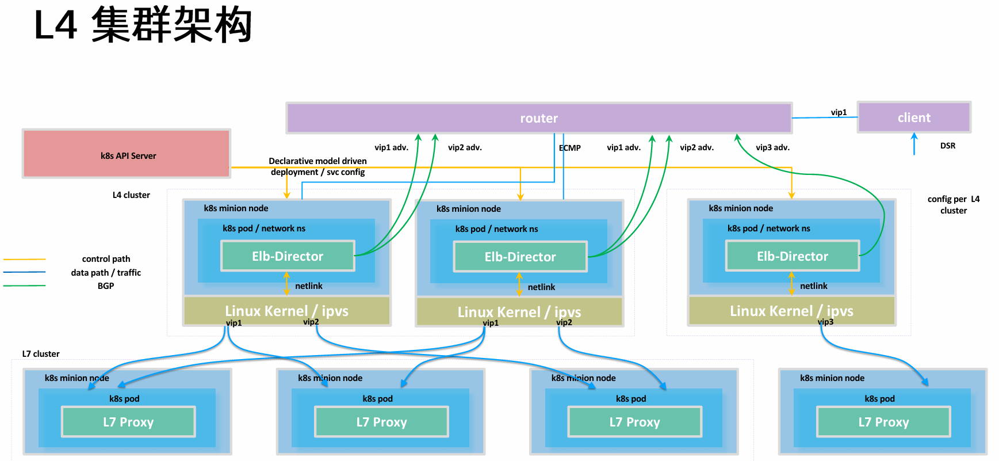
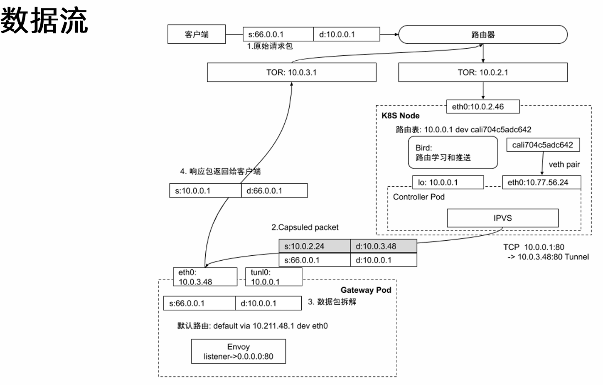

# Ingress

Ingress 本身是躲在 L4 负载均衡下的用来转发高级流量规则的组件，
不能独立的完成所有的 NAT

- L4 ip:port iptables/ipvs NAT
- L7 nginx/envoy 基于头和体做高级流量转发


ingress 就是 pod，针对外部客户，通过 service 发布出去，
建立一个 nodePort，
podIP 是不对外开放的，但是 nodeIP 外部是可见的，
外部客户通过 nodePort 进入集群，通过 iptables/ipvs 做 NAT 转发，
到 pod 里，这个时候 ingress 发挥作用，
解析请求，通过 nginx/envoy 再做转发，
做到高级流量转发


ingress pod 里有两个进程，nginx 和 ingress controller
- nginx 接受请求 转发请求
- ingress controller watch ingress 配置 nginx
  - ingress controller 生成 nginx.conf
  - 然后动态加载 nginx -s reload

ingress service 把服务通过 nodePort 发布出来，外部能够访问到 ingress pod 内的 nginx

## ingress 配置流量转发

```yaml
# ingress.yaml
apiVersion: networking.k8s.io/v1
kind: Ingress
metadata:
  name: gateway
  annotations:
    kubernetes.io/ingress.class: "nginx"
spec:
  tls:
    # 访问 test.com 开启 TLS 加密
    # 加密信息放在 secret 中
    - hosts:
        - test.com
      secretName: test-tls
  rules:
    - host: test.com
      http:
        paths:
          - path: "/"
            pathType: Prefix
            backend:
              # test.com/ 访问 nginx service
              service:
                name: nginx
                port:
                  number: 80
```

> 通过简单的 ingress 对象配置 可以配置简单的流量转发

> 通过访问 nodeIP:nodePort (ingress-nginx-controller service) 转发到 ingress controller 的 nginx
> 然后通过 nginx 做高级流量转发
> 规则是通过 ingress 对象配置的 只能做简单的流量转发规则

```shell

```

ingress 不满足需求
- 当配置 tls 会有很多的安全需求
- 按照请求头转发规则不能支持
- 难以同一正则表达式
- 改写

**如果项目已经毕业，如何去满足其他需求？**

annotation 来实现简单功能 但是还是 L7 需求的一小部分


## 通过 ingress 实现异地多活

### 构建 SLB(soft loadBalancer)







## envoy 数据面

基于Envoy的数据面项目
- Contour
- Istio


## istio 提供了一套完备的流量治理的解决方案


