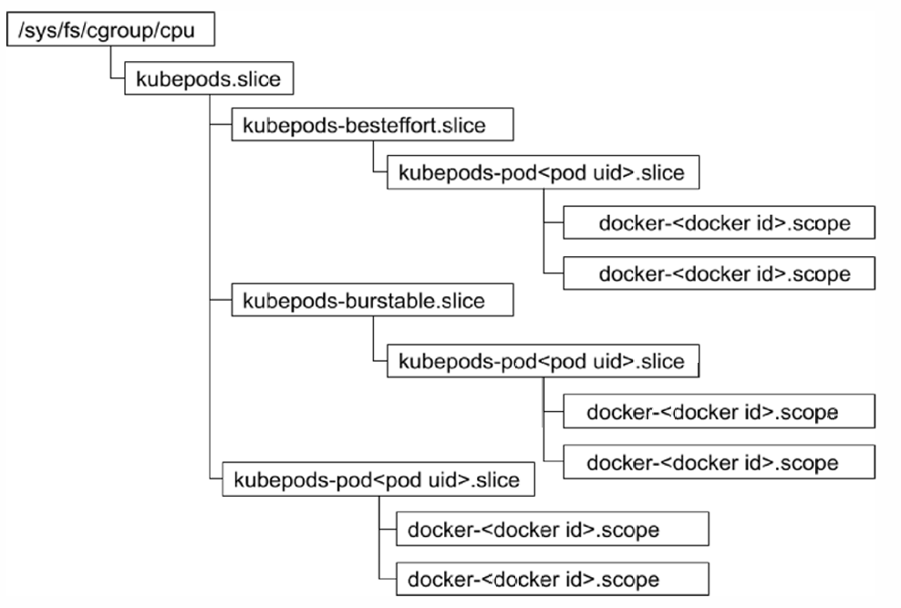

# 节点资源管理

## 状态上报


```shell
k get lease node1 -oyaml -n kube-node-lease
#apiVersion: coordination.k8s.io/v1
#kind: Lease
#metadata:
#  creationTimestamp: "2024-10-26T03:38:21Z"
#  name: node1
#  namespace: kube-node-lease
#  ownerReferences:
#  - apiVersion: v1
#    kind: Node
#    name: node1
#    uid: 5ecaaec7-3688-4c69-8b69-1822ff352fdc
#  resourceVersion: "395334"
#  uid: 7a373a2f-a3a6-44b3-b8f1-fdd957da684f
#spec:
#  holderIdentity: node1
#  leaseDurationSeconds: 40
#  renewTime: "2024-10-29T09:29:40.840354Z"
```

- holderIdentity 谁拿到这个 lease
- leaseDurationSeconds 这个 lease 持有多久
- renewTime 上次更新的时间

如果超过这个时间 kubelet 还没有 renew 则说明节点不健康


## 资源预留


- Capacity
  - 节点资源能力
  - `cat /proc/cpuinfo`
  - `cat /proc/meminfo`
  - `kube-reserved` + `system-reserved` + `eviction-threshold`
- Allocatable


节点磁盘管理

- nodefs
  - 工作目录和容器日志
  - `ls /var/lib/kubelet/pods/`
- imagefs
  - `ls /var/lib/containerd/`


## 驱逐管理

不可压缩资源 kubelet 自保 做驱逐管理 终止一些容器进程


## 资源可用额监控





## OOM Killer

```yaml


```


