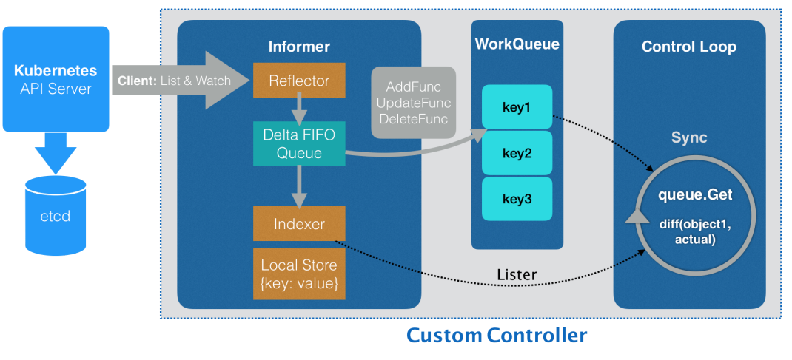

### 深入理解控制器

---

List&Watch

我的控制器需要与APIServer建立链接，
同时获取所关心的对象，
都是Reflector组件完成的功能

其中 List&Watch，
首先会从apiserver中list所有关心的对象，
把所有对象存入本地的indexer缓存，
存储的方式是key-value方式，
其中key一般是namespace/name形式，
然后监听apiserver中关于该类对象的操作事件，
创建、删除或者更新

监听机制有个严重的问题就是事件会丢失，
如何处理事件丢失？

通过ResourceVersion，
如果请求监听的版本与当前版本差距过大，
则Reflector组件重新List数据，
而不是Watch，
所以即使有存在事件丢失的风险，
通过List和ResourceVersion的机制也能确保最终一致性。
也就是说针对于Kubernetes的声明式API系统设计，
我们减少对于时效性的关注，
更多的是最终一致性的确保

---

FIFO Queue

在List&Watch机制下，
Reflector会收到事件通知，
那么该事件和其对应的对象会放到FIFO Queue中，
informer会从FIFO Queue中读取对象，
根据不同的事件操作本地indexer缓存，
创建、更新或者删除

所以informer最重要的功能就是同步本地缓存，
其次就是触发ResourceEventHandler

---

workQueue 同步informer和控制循环之间的数据

其实，
所谓的informer就是一个带有本地缓存和索引机制的、
可以注册EventHandler的client，
它通过一种叫做List&Watch的方法，
把apiserver中的对象保存在本地，
并负责更新和维护这个缓存，
同时可以经过一定时间强制list更新一次缓存，
从而保证缓存有效性

问题：为什么informer和syncLoop之间一定要使用一个工作队列来进行协作呢

1、解耦生产者消费者 即使控制循环处理较慢 也不会阻塞informer事件监听

2、提供幂等性和重试机制 工作队列有重试机制 确保任务不会丢失

高内聚 低耦合

