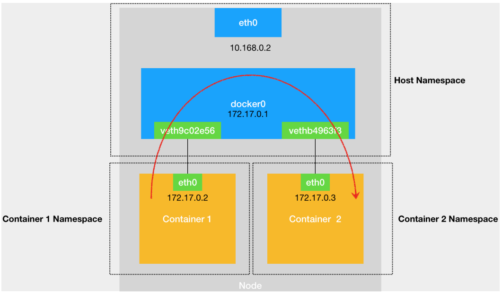
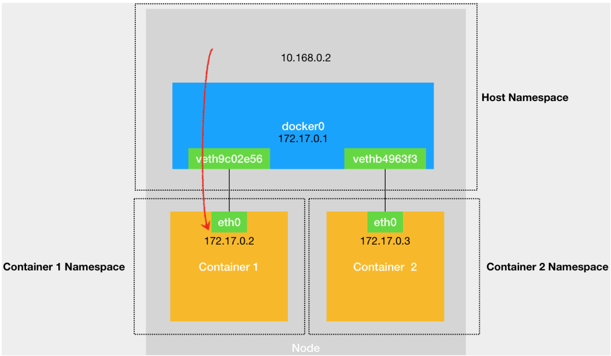
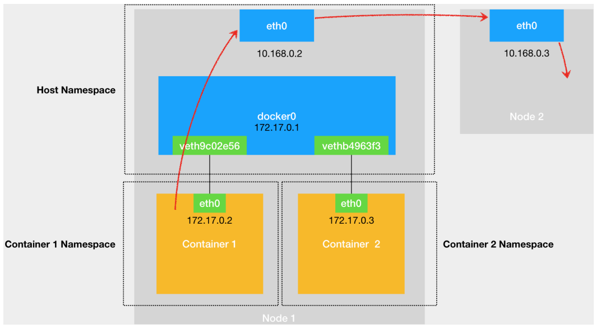
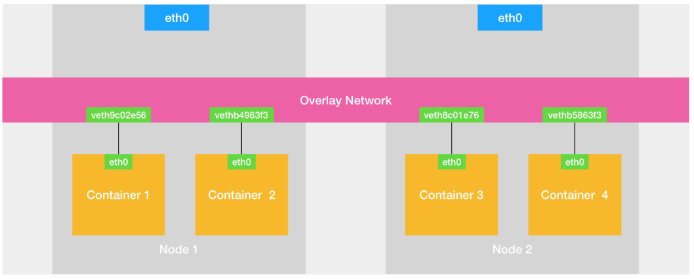

### CNI

VethPair设备：

创建出来之后，
总是以两张虚拟网卡VethPeer形式成对出现，
从其中一个网卡发出的数据包，
可以直接出现在与他对应的另一张网卡上，
哪怕是在不同的NetworkNamespace中

VethPair设备常常用作链接不同NetworkNamespace的网线

同一主机不同容器交流

docker0：网桥

Container1想要访问Container2就需要eth0发送ARP广播，
通过IP地址查找对应的MAC地址，
docker0收到ARP请求之后，
广播到其他虚拟网卡上

所以，
当容器联不通外网的时候，
都应该试试docker0能不能ping通，
再查看docker0和vethPair相关的iptables规则是否异常

---

跨主机的容器访问

覆盖网络：在已有的宿主机上，通过软件构建一个覆盖在宿主机网络之上的、
可以把所有容器联通在一起的虚拟网络

