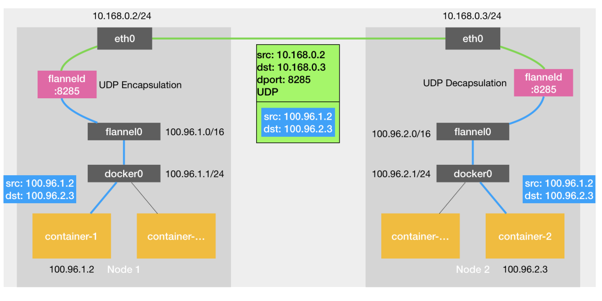
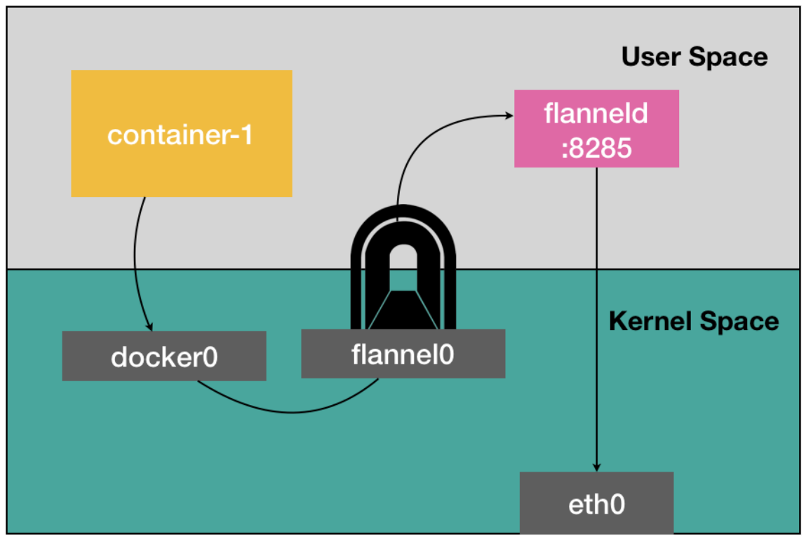
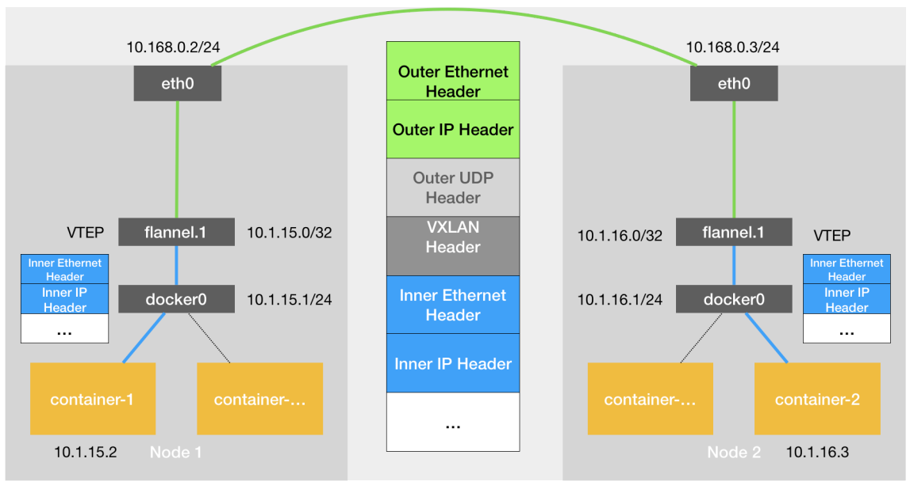

### 跨主机通讯

#### Flannel UPD

node1
- container-1
- ip: 100.96.1.2
- docker0: 100.96.1.1/24

node2
- container-2
- ip: 100.96.2.3
- docker0: 100.96.2.1/24

Flannel进程向TUN设备发送数据包是用户态向内核态的流动方向

每台机器上跑一个Flannel进程，
每台机器上有一个flannel0设备

Flannel UDP 模式提供的其实是一个三层的 Overlay 网络，
但是相比于两台宿主机之间的直接通讯，
基于Flannel UDP模式的容器多了一个额外的步骤，
就是flannel进程处理的过程

发生三次用户态和内核态的数据拷贝，
上下文切换的代价比较高

#### Flannel VXLAN

VXLAN可以完全在内核态完成上述封装和解封装的工作

