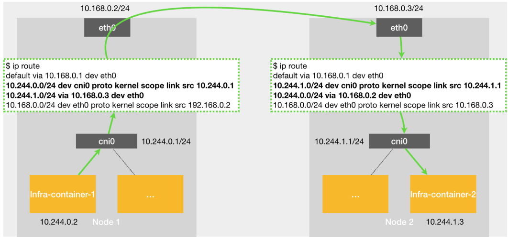
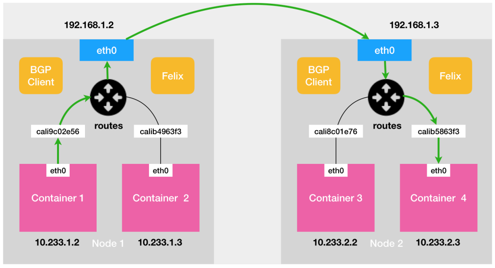

### kubernetes 网络

CNI的设计思想，
就是kubernetes在启动infra容器之后，
可以直接调用CNI网络插件，
为这个infra容器的NetworkNamespace配置符合预期的网络栈

网络栈：网卡、Loopback、路由表、iptables

===========================================

三层网络结构的设计

Calico和Flannel host模式是完全一样的

`10.244.1.0/24 via 10.168.0.3 dev eth0`

都是通过这样的路由规则去直接指定下一跳的目标IP，
这种模式下就免除了额外的封包解包带来的性能损耗

三层网络方案得以正常工作的核心，
是每个容器的IP地址，
找到对应的下一跳的网关

- Flannel
  - 通过Etcd和宿主机上的flanneld来维护路由信息
- Calico
  - 通过BGP Border Gateway Protocol 边界网关协议
  - 不会在宿主机上创建网桥

Calico:
- 1、CNI 插件
- 2、Felix 负责在宿主机上插入路由规则
- 3、BIRD BGP 客户端 负责在集群里分发路由规则信息

由于Calico没有使用CNI网桥，
所以需要为每个容器的VethPair配置一条路由规则，
用于接受传入的IP包

可是如果宿主机不在同一个子网里，
就需要打开IPIP模式

